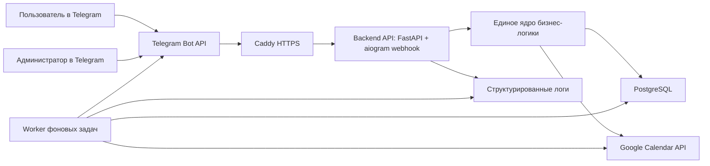
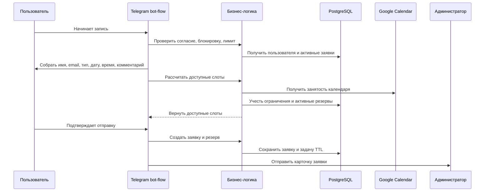
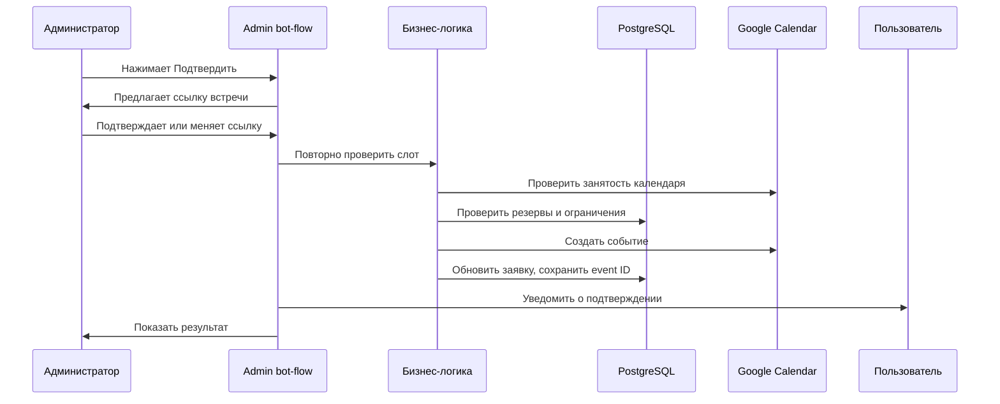
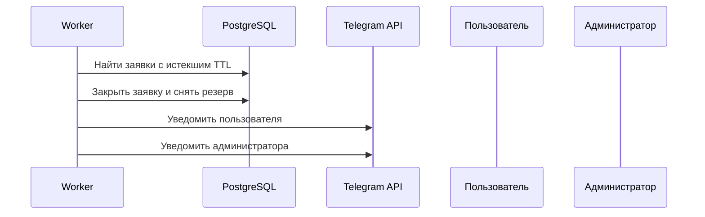

# Стек используемых технологий

Проект: Telegram-бот "Ассистент по встречам"  
Основание: `Итоговое_ТЗ_Telegram_бот_ассистент_по_встречам.md`  
Статус документа: для согласования перед началом разработки  

---

## 1. Цель документа

Документ фиксирует предлагаемый технологический стек, архитектуру MVP и решения, которые нужно согласовать до начала разработки.

Главный принцип: backend должен быть единым ядром бизнес-логики. Telegram-бот в MVP является первым интерфейсом, но правила расписания, заявок, резервов, Google Calendar и хранения данных не должны быть зашиты только в Telegram-сценарии. Это позволит позже подключить Telegram Mini App без переписывания ключевой логики.

---

## 2. Рекомендуемый стек MVP

| Область | Рекомендуемая технология | Зачем используется | Статус |
|---|---|---|---|
| Язык backend | Python 3.12 | Быстрая разработка, хорошая поддержка Telegram-ботов, Google API, тестов и Docker | Нужно согласовать |
| Telegram-бот | aiogram 3.x | Современная асинхронная библиотека для Telegram Bot API, удобна для многошаговых сценариев | Нужно согласовать |
| HTTP/API слой | FastAPI | Webhook Telegram, OAuth callback Google, будущий API для Mini App | Нужно согласовать |
| ASGI-сервер | Uvicorn | Запуск FastAPI-приложения в контейнере | Нужно согласовать |
| База данных | PostgreSQL 16 | Надежное хранение заявок, пользователей, резервов, логов, настроек | Согласовано в ТЗ |
| Работа с БД | SQLAlchemy 2.x | Описание моделей данных и работа с PostgreSQL | Нужно согласовать |
| Миграции БД | Alembic | Контролируемое изменение структуры базы | Нужно согласовать |
| Валидация данных | Pydantic 2.x | Проверка настроек, email, входных данных, конфигурации | Нужно согласовать |
| Google Calendar | google-api-python-client, google-auth, google-auth-oauthlib | OAuth и работа с Google Calendar API | Нужно согласовать |
| Фоновые задачи | Отдельный worker на Python, читающий задачи из PostgreSQL | TTL 48 часов, напоминания, повторы интеграций без Redis и Celery | Нужно согласовать |
| Очередь задач | PostgreSQL-таблицы задач | Достаточно для низкой нагрузки MVP, меньше инфраструктуры | Нужно согласовать |
| Логирование | Стандартный logging + структурированные JSON-логи | Быстро искать ошибки, понимать сценарий сбоя | Нужно согласовать |
| Тестирование | pytest, pytest-asyncio | Unit, integration и сценарные тесты | Нужно согласовать |
| HTTP-тесты | httpx | Проверка API, webhook, OAuth callback | Нужно согласовать |
| Моки внешних API | respx или pytest monkeypatch | Проверка Telegram и Google без реальных вызовов | Нужно согласовать |
| Контейнеризация | Docker, Docker Compose | Развертывание на VPS и локальная разработка | Согласовано в ТЗ |
| Reverse proxy и HTTPS | Caddy | Автоматический HTTPS Let's Encrypt, проще для новичка, чем Nginx + Certbot | Нужно согласовать |
| Конфигурация | `.env` + Pydantic Settings | Безопасное хранение токенов и настроек вне кода | Нужно согласовать |
| Формат документации | Markdown | Простые рабочие документы в репозитории | Согласовано фактически |

---

## 3. Почему предлагается именно такой стек

### 3.1. Python 3.12

Плюсы:

1. Быстрое создание MVP.
2. Хорошая поддержка Telegram-ботов.
3. Хорошая поддержка Google API.
4. Удобное тестирование бизнес-логики.
5. Низкий порог сопровождения.

Альтернативы:

1. Node.js + NestJS - сильный вариант для больших API, но для данного MVP будет больше инфраструктурного кода.
2. Go - надежно и быстро, но дольше разработка сценариев бота и интеграций.

Рекомендация: Python 3.12.

### 3.2. aiogram 3.x

Плюсы:

1. Подходит для многошаговых Telegram-сценариев.
2. Хорошо работает с inline-кнопками.
3. Поддерживает webhook и long polling.
4. Асинхронная модель подходит для интеграций и фоновых операций.

Рекомендация: aiogram 3.x.

### 3.3. FastAPI

FastAPI нужен не только для Telegram webhook. Он также закрывает будущую архитектурную потребность: подключение Telegram Mini App к тому же backend.

В MVP FastAPI может использоваться для:

1. Telegram webhook.
2. Google OAuth callback.
3. Healthcheck endpoint для проверки, что сервис жив.
4. Внутренние диагностические endpoint'ы без доступа извне или с защитой.

В v1.1 FastAPI станет основой API для Mini App.

Рекомендация: FastAPI.

### 3.4. PostgreSQL

PostgreSQL уже согласован в ТЗ.

Используется для:

1. Пользователей.
2. Заявок.
3. Рабочих часов.
4. Ручных ограничений.
5. Типов встреч.
6. Внутренних резервов.
7. Очереди фоновых задач.
8. Audit-log.
9. Настроек проекта.

Рекомендация: PostgreSQL 16.

### 3.5. Worker без Redis и Celery

Для MVP ожидается низкая нагрузка: до 3-4 заявок в день. Поэтому отдельная брокерная инфраструктура в виде Redis/Celery не обязательна.

Рекомендуемый вариант:

1. Все запланированные действия хранятся в PostgreSQL.
2. Отдельный worker-контейнер раз в короткий интервал проверяет задачи со сроком выполнения.
3. Worker выполняет TTL-закрытие, Telegram-напоминания, повторные попытки отправки и проверки событий календаря.
4. Для защиты от дублей используется статус задачи и блокировка записи на время обработки.

Плюсы:

1. Меньше инфраструктуры.
2. Проще развернуть на VPS.
3. После перезапуска задачи не теряются.
4. Достаточно для MVP.

Минус:

1. Для высокой нагрузки в будущем может потребоваться Redis/Celery или другая очередь.

Рекомендация: PostgreSQL-backed worker в MVP, Redis/Celery оставить вне scope.

### 3.6. Caddy для HTTPS

Telegram webhook требует HTTPS. Для новичка проще использовать Caddy, потому что он автоматически выпускает и обновляет HTTPS-сертификаты при корректно настроенном домене.

Альтернатива:

1. Nginx + Certbot.

Рекомендация для MVP: Caddy.

---

## 4. Архитектура MVP

### 4.1. Общая схема



### 4.2. Логические слои

#### Слой интерфейсов

Отвечает за входящие и исходящие каналы:

1. Telegram bot-flow пользователя.
2. Telegram bot-flow администратора.
3. Google OAuth callback.
4. Healthcheck.
5. Будущий API для Telegram Mini App.

Слой интерфейсов не должен содержать ключевые правила расписания и заявок. Он только принимает действия пользователя, вызывает бизнес-логику и показывает результат.

#### Слой бизнес-логики

Отвечает за:

1. Создание заявок.
2. Проверку лимита активных заявок.
3. Проверку согласия на обработку персональных данных.
4. Расчет доступных слотов.
5. Проверку конфликтов.
6. Создание и снятие внутренних резервов.
7. Изменение статусов заявок.
8. Правила отмены и переноса.
9. Правила блокировки пользователя.
10. Подготовку данных для Google Calendar.

Этот слой должен быть независим от Telegram, чтобы Mini App в будущем использовала те же правила.

#### Слой интеграций

Отвечает за:

1. Telegram API.
2. Google Calendar API.
3. OAuth Google.
4. Отправку уведомлений.
5. Повторы при временных ошибках.

#### Слой хранения данных

Отвечает за:

1. PostgreSQL.
2. Миграции.
3. Работающие транзакции.
4. Защиту от дублей при подтверждении и резервировании.

#### Слой фоновых задач

Отвечает за:

1. Автоматическое закрытие заявок через 48 часов.
2. Telegram-напоминания за 24 часа и 1 час.
3. Повторные попытки интеграций.
4. Проверку удаленных или измененных событий Google Calendar перед напоминаниями.
5. Очистку audit-log старше 30 дней.

---

## 5. Основные потоки данных

### 5.1. Создание заявки



### 5.2. Подтверждение заявки



### 5.3. Автоматическое закрытие заявки



---

## 6. Структура будущего проекта

Предлагаемая структура на уровне папок:

```text
project/
  app/
    interfaces/
      telegram_user/
      telegram_admin/
      http/
    core/
      scheduling/
      booking/
      users/
      meeting_types/
      notifications/
    integrations/
      google_calendar/
      telegram/
    persistence/
      models/
      repositories/
      migrations/
    worker/
    settings/
    logging/
  tests/
    unit/
    integration/
    e2e/
  deploy/
    docker/
    caddy/
  docs/
```

Это ориентир для разработки. Точная структура может быть уточнена на этапе проектирования репозитория, но обязательный принцип сохраняется: бизнес-логика отделена от Telegram-интерфейса.

---

## 7. Логирование

### 7.1. Что логировать всегда

1. Старт и остановку приложения.
2. Старт и остановку worker.
3. Входящие Telegram-события без хранения лишнего текста, если он не нужен для диагностики.
4. Создание заявки.
5. Изменение статуса заявки.
6. Расчет слотов: дата, тип встречи, количество найденных слотов, без раскрытия деталей календаря.
7. Вызовы Google Calendar.
8. Ошибки Google Calendar.
9. Отправку Telegram-уведомлений.
10. Ошибки Telegram.
11. Срабатывание TTL.
12. Отправку напоминаний.
13. Административные действия.

### 7.2. Формат логов

Рекомендуемый формат: структурированный JSON.

Обязательные поля:

1. timestamp.
2. level.
3. service: app или worker.
4. event.
5. request_id или operation_id.
6. user_id, если применимо.
7. booking_id, если применимо.
8. admin_action, если применимо.
9. error_type, если есть ошибка.
10. message.

### 7.3. Что нельзя писать в логи

1. Google OAuth refresh token.
2. Telegram bot token.
3. Полные OAuth-реквизиты.
4. Секретные значения из `.env`.
5. Избыточные персональные данные, если они не нужны для диагностики.

Email можно логировать только в замаскированном виде, например `a***@example.com`.

---

## 8. Безопасность и доступы

### 8.1. Секреты

Все секреты хранятся в `.env` или переменных окружения:

1. Telegram bot token.
2. Telegram ID администратора.
3. Google OAuth client ID.
4. Google OAuth client secret.
5. Database URL.
6. Secret для webhook, если используется.

### 8.2. Доступ к базе

1. PostgreSQL не должен быть открыт в интернет.
2. Доступ к БД получают только контейнеры приложения внутри Docker-сети.
3. Для подключения к БД используется отдельный пользователь с ограниченными правами.

### 8.3. Админ-доступ

1. Все административные действия доступны только Telegram ID администратора.
2. Если неизвестный пользователь вызывает админ-команду, действие отклоняется и логируется.

---

## 9. Окружения

### 9.1. Local/dev

Используется для разработки и проверки:

1. Приложение запускается локально.
2. PostgreSQL запускается через Docker Compose.
3. Telegram может работать через long polling или временный webhook-туннель.
4. Google Calendar может быть заменен моками в тестах.

### 9.2. Production

Используется для реальной работы:

1. VPS.
2. Docker Compose.
3. Caddy.
4. HTTPS.
5. Telegram webhook.
6. PostgreSQL в Docker-сети.
7. App-контейнер.
8. Worker-контейнер.

---

## 10. Решения, которые нужно согласовать

Перед началом разработки нужно утвердить:

1. Python 3.12 как язык backend.
2. aiogram 3.x для Telegram-бота.
3. FastAPI для webhook, OAuth callback и будущего API Mini App.
4. SQLAlchemy 2.x и Alembic для PostgreSQL.
5. PostgreSQL-backed worker без Redis/Celery в MVP.
6. Caddy для HTTPS на VPS.
7. JSON-логи.
8. Docker Compose как формат запуска.
9. Отсутствие резервных копий в MVP как осознанное ограничение.
10. Использование Telegram long polling только для локальной разработки, webhook для production.

---

## 11. Что не использовать в MVP

1. Redis.
2. Celery.
3. Kubernetes.
4. Отдельную веб-админку.
5. Отдельный email-сервис.
6. CRM-интеграции.
7. Несколько календарей.
8. Несколько администраторов.
9. Сложную BI-аналитику.

Эти решения не запрещены навсегда, но для MVP они увеличивают стоимость, сроки и сложность эксплуатации.

