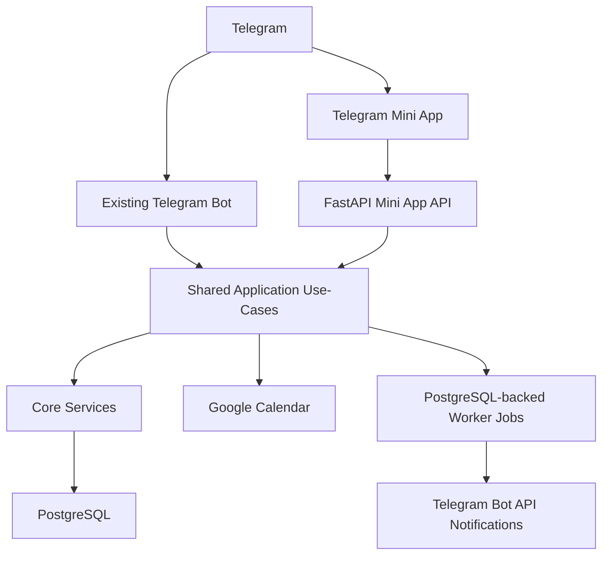

# Техническое задание

## Telegram Mini App "Ассистент по встречам"

Дата подготовки: 2026-07-13  
Рабочая ветка для разработки: `dev`  
Production-ветка: `master`  
Репозиторий: `https://github.com/irina550894/meeting_assistant.git`  
Production-домен: `https://calendar.finforbiz.pro`

## Executive Summary

Нужно разработать Telegram Mini App для существующего Telegram-бота "Ассистент по встречам".

Mini App должна стать дополнительным пользовательским и административным интерфейсом к уже работающему backend-ядру. Текущий Telegram-бот остается рабочим, не удаляется и не заменяется. Все бизнес-правила заявок, согласий, доступных слотов, резервов, отмен, переносов, Google Calendar и worker-задач должны переиспользоваться из существующего backend, а не дублироваться во frontend или в отдельных API-обработчиках.

Mini App MVP включает:

1. Пользовательский интерфейс для записи на встречу.
2. Пользовательский интерфейс для просмотра, отмены и переноса своих заявок.
3. Административный раздел Mini App, доступный только администратору.
4. Dashboard-UX с карточками, календарем, нижней навигацией и визуальными уведомлениями.
5. FastAPI API для Mini App.
6. Telegram WebApp авторизацию через проверку `initData`.
7. Audit-log с указанием источника действия: `telegram_bot` или `mini_app`.
8. Аналитику открытий Mini App и незавершенных заявок.

## 1. Цели проекта

### 1.1. Бизнес-цели

1. Сделать запись на встречу удобнее, чем в пошаговом Telegram bot-flow.
2. Дать пользователю визуальный интерфейс с календарем, карточками заявок и статусами.
3. Дать администратору компактный Mini App dashboard для обработки заявок.
4. Сохранить текущий Telegram-бот как альтернативный и резервный интерфейс.
5. Не переписывать и не дублировать уже реализованную бизнес-логику.

### 1.2. Технические цели

1. Добавить frontend Mini App внутри текущего production-домена.
2. Добавить FastAPI endpoints для Mini App.
3. Добавить проверку Telegram WebApp `initData`.
4. Выделить общий прикладной слой пользовательских и админских use-case, если текущая orchestration находится внутри Telegram router.
5. Переиспользовать `app/core/booking`, `app/core/scheduling`, `app/core/user_flow`, `app/core/admin_flow`, Google Calendar integration, PostgreSQL storage и worker.
6. Сохранить существующий deploy-подход: VPS, Docker Compose, system Caddy, GitHub Actions checks.

### 1.3. Метрики успеха MVP

1. Пользователь может открыть Mini App из Telegram и создать заявку без перехода в bot-flow.
2. Пользователь может увидеть свои заявки, статусы, ссылки Google Meet/Calendar после подтверждения.
3. Пользователь может отменить и запросить перенос встречи по тем же правилам, что в боте.
4. Администратор может открыть вкладку `Админ`, увидеть заявки и выполнить основные действия.
5. Заявки из Mini App попадают в тот же backend, ту же БД, тот же worker и тот же Google Calendar flow.
6. Telegram-бот продолжает работать после релиза Mini App.
7. Автотесты и ручной UAT проходят.

## 2. Принятые решения

1. Mini App делается и для пользователя, и для администратора.
2. Админ-раздел находится в нижней навигации и виден только администратору.
3. Telegram-бот остается рабочим интерфейсом.
4. UX Mini App не копирует пошаговый bot-flow, а использует вебовый сценарий с формой и календарем.
5. Frontend рекомендуется делать на `Vite + React + TypeScript`.
6. Авторизация рекомендуется через server-side проверку `initData` и короткоживущую backend-сессию.
7. В audit-log нужно различать источник действия.
8. Ссылки Google Meet/Calendar нужно показывать в Mini App после подтверждения встречи.
9. Отмена подтвержденной встречи из Mini App разрешена по тем же правилам, что в Telegram-боте.
10. Перенос встречи повторяет текущую модель: создается новая `pending`-заявка, старая получает статус `reschedule_requested`.
11. В Mini App нужны визуальные уведомления.
12. Для согласий используется одна кнопка принятия, ниже размещаются кликабельные ссылки на согласие и политику.
13. Нужно поддержать Telegram WebApp theme params, BackButton и MainButton/BottomButton.
14. Нужна аналитика открытий Mini App и незавершенных заявок.
15. Frontend размещается внутри текущего домена `calendar.finforbiz.pro`, например по пути `/miniapp`.
16. Отдельный staging-контур не нужен. Достаточно ветки `dev`, локальных тестов и ручной проверки в Telegram.
17. Управление расписанием, ограничениями, типами встреч, подтверждением, отклонением, отменой и переносами должно быть доступно и в Mini App, и в Telegram-боте.

## 3. Границы проекта

### 3.1. Scope MVP: пользователь

1. Открытие Mini App из Telegram.
2. Авторизация через Telegram WebApp.
3. Отображение состояния пользователя:
   - имя;
   - username;
   - email, если сохранен;
   - статус согласия;
   - статус блокировки.
4. Принятие согласия на обработку персональных данных.
5. Создание заявки:
   - имя;
   - email;
   - тип встречи;
   - длительность;
   - дата;
   - время;
   - комментарий;
   - финальное подтверждение.
6. Просмотр своих заявок.
7. Просмотр карточки заявки.
8. Отмена ожидающей заявки.
9. Отмена подтвержденной встречи по текущим правилам cancellation deadline.
10. Запрос переноса подтвержденной встречи.
11. Просмотр Google Meet/Calendar ссылок после подтверждения.
12. Визуальные уведомления внутри Mini App.

### 3.2. Scope MVP: администратор

Админ-раздел Mini App доступен только пользователю, чей Telegram ID соответствует `TELEGRAM_ADMIN_ID`.

В MVP входят:

1. Админская вкладка `Админ` в нижней навигации.
2. Dashboard с краткими метриками:
   - ожидающие заявки;
   - подтвержденные встречи;
   - заявки на перенос;
   - отмененные заявки;
   - ближайшие встречи.
3. Список заявок с фильтрами:
   - все;
   - ожидают;
   - подтверждены;
   - перенос;
   - отменены/закрыты.
4. Карточка заявки:
   - пользователь;
   - Telegram username;
   - email;
   - тип встречи;
   - дата и время;
   - длительность;
   - комментарий;
   - статус;
   - источник создания;
   - Google Calendar event ID, если есть;
   - ссылка встречи, если есть.
5. Подтверждение заявки.
6. Отклонение заявки с причиной.
7. Обработка заявки на перенос.
8. Отмена подтвержденной встречи администратором, если это уже поддерживается текущим backend-flow.
9. Просмотр базового календаря/плана встреч.
10. Управление расписанием:
   - просмотр текущих настроек;
   - просмотр рабочих часов;
   - изменение рабочих часов, если это поддержано текущим backend-scope;
   - просмотр горизонта записи, шага слотов, буфера и дедлайнов.
11. Управление ограничениями расписания:
   - просмотр ближайших ограничений;
   - добавление закрытого дня;
   - удаление ограничения.
12. Управление типами встреч:
   - просмотр активных и неактивных типов;
   - добавление типа встречи;
   - включение/отключение типа встречи.
13. Блокировка и разблокировка пользователей, если текущий backend-flow позволяет вынести это без крупной отдельной доработки.
14. Отправка сообщения пользователю через бота, если текущий notifier можно безопасно переиспользовать в Mini App.

### 3.3. MVP+ / v1.1

Эти функции можно делать после первого релиза Mini App:

1. Расширенная аналитика и графики.
2. Export заявок.
3. Мультиадмин и роли.
4. Массовые операции с расписанием.
5. Расширенный редактор recurring working hours, если MVP ограничится текущими возможностями backend.

### 3.4. Out of scope MVP

1. Удаление Telegram-бота.
2. Переписывание backend на другой стек.
3. Публичная запись без Telegram.
4. Регистрация по телефону/email вне Telegram.
5. Отдельный SMTP-сервис.
6. Отдельный staging-контур.
7. Платежи.
8. Мультиадмин с ролями, если это не будет отдельно согласовано.

## 4. Текущий backend и что переиспользуется

### 4.1. Существующие модули

Mini App должна использовать:

1. `app/core/booking` - бизнес-логика заявок, статусов, резервов, отмен, переносов.
2. `app/core/scheduling` - расчет доступных слотов, рабочие часы, ограничения, буфер.
3. `app/core/user_flow` - сценарная логика пользователя без привязки к Telegram UI.
4. `app/core/admin_flow` - сценарная логика администратора.
5. `app/integrations/google_calendar` - Google OAuth, freebusy, создание и отмена событий.
6. `app/persistence/models` - SQLAlchemy-модели.
7. `app/persistence/migrations` - Alembic-миграции.
8. `app/worker` - TTL, напоминания, повторы, очистка audit-log.
9. `app/interfaces/http` - FastAPI routes.
10. `app/integrations/telegram` - остается для текущего бота.

### 4.2. Важное архитектурное требование

Нельзя переносить бизнес-правила во frontend Mini App.

Нельзя копировать бизнес-логику из Telegram router в Mini App routes.

Если сейчас какая-то orchestration находится внутри `app/integrations/telegram/user_router.py` или `app/integrations/telegram/admin_router.py`, ее нужно вынести в общий application service/use-case, который смогут вызывать:

1. Telegram bot-flow.
2. Mini App API.
3. Тесты.

Примеры orchestration, которую нельзя дублировать:

1. Сохранение созданной заявки.
2. Создание audit-log.
3. Постановка background jobs после создания/подтверждения заявки.
4. Отправка Telegram-уведомлений.
5. Отмена события Google Calendar при отмене подтвержденной встречи.
6. Завершение переноса старой заявки после подтверждения новой.

## 5. Архитектура Mini App

### 5.1. Общая схема



### 5.2. Frontend размещение

Frontend размещается внутри текущего production-домена:

1. `https://calendar.finforbiz.pro/miniapp` - Mini App frontend.
2. `https://calendar.finforbiz.pro/api/miniapp/...` - Mini App API.
3. `https://calendar.finforbiz.pro/telegram/webhook` - существующий webhook бота.
4. `https://calendar.finforbiz.pro/health` - существующий healthcheck.

### 5.3. Рекомендованный frontend-стек

Рекомендуется `Vite + React + TypeScript`.

Обоснование:

1. Требуется не простая форма, а dashboard UX.
2. Нужны календарь, карточки, фильтры, статусы, визуальные уведомления.
3. Нужен админ-раздел.
4. Нужна нормальная работа с состояниями загрузки, ошибок, авторизации и Telegram WebApp API.
5. TypeScript снижает риск ошибок в API contracts.

Минусы:

1. Добавляется Node.js и frontend build step.
2. Нужно обновить Dockerfile/GitHub Actions/deploy.
3. Нужно следить за frontend-зависимостями.

Альтернативы:

1. Static HTML/CSS/JS - проще деплой, но хуже поддерживаемость для dashboard.
2. FastAPI templates/HTMX - ближе к Python, но хуже подходит для Telegram WebApp с богатым мобильным UX.

## 6. Запуск Mini App из Telegram

### 6.1. Рекомендуемый вариант

Нужно настроить несколько удобных входов:

1. Main Mini App в профиле бота.
2. Menu Button бота.
3. Inline-кнопка `Открыть Mini App` после `/start`.

Это практичный вариант, потому что:

1. Новый пользователь видит кнопку в профиле бота.
2. Постоянный пользователь быстро открывает Mini App из меню.
3. `/start` остается привычным входом и может объяснить, что доступно в Mini App и в боте.

### 6.2. Telegram-настройки

Нужно настроить в BotFather:

1. Mini App URL.
2. Название кнопки.
3. Иконку/preview, если требуется.
4. Main Mini App, если используется запуск из профиля.

Через Bot API можно дополнительно настроить:

1. `setChatMenuButton`.
2. Inline keyboard button с `web_app`.

## 7. Авторизация и безопасность

### 7.1. Базовый принцип

Mini App получает от Telegram `Telegram.WebApp.initData`.

Backend должен проверять `initData` на сервере. Нельзя доверять только `initDataUnsafe` на frontend.

### 7.2. Рекомендуемая схема

1. Frontend открывается внутри Telegram.
2. Frontend отправляет `initData` на `POST /api/miniapp/auth/telegram`.
3. Backend проверяет подпись `initData` с использованием `TELEGRAM_BOT_TOKEN`.
4. Backend проверяет `auth_date`.
5. Backend создает или обновляет пользователя по `telegram_id`.
6. Backend выдает короткоживущую session cookie:
   - `HttpOnly`;
   - `Secure`;
   - `SameSite=None` или другой режим после проверки в Telegram WebView;
   - без хранения секретов во frontend.
7. Последующие API-запросы используют session cookie.

### 7.3. Плюсы схемы с backend-сессией

1. Frontend не хранит секреты.
2. API-запросы проще.
3. Можно централизованно завершать сессию.
4. Удобно для React-приложения.
5. Можно логировать session-level события без сохранения чувствительных данных.

### 7.4. Минусы схемы с backend-сессией

1. Нужно добавить session-механику.
2. Нужно аккуратно настроить cookie для Telegram WebView.
3. Может понадобиться новая таблица `mini_app_sessions`.

### 7.5. Альтернатива

Можно валидировать `initData` на каждый запрос.

Плюсы:

1. Меньше серверного состояния.
2. Не нужна таблица сессий.

Минусы:

1. Каждый запрос должен передавать `initData`.
2. Сложнее клиентский код.
3. Больше повторяющейся auth-логики.
4. Сложнее контролировать пользовательскую сессию.

### 7.6. Требования безопасности

1. Не писать `TELEGRAM_BOT_TOKEN` во frontend.
2. Не логировать полный `initData`.
3. Не логировать email, токены, cookie, Google OAuth secrets.
4. Проверять `auth_date` и максимальный возраст авторизации.
5. Все Mini App endpoints должны работать только по HTTPS в production.
6. Пользователь может видеть только свои заявки.
7. Админские endpoints доступны только `TELEGRAM_ADMIN_ID`.
8. PostgreSQL не должен быть открыт в интернет.

## 8. UX и дизайн

### 8.1. Дизайн-референс

Визуальный стиль Mini App должен опираться на приложенный файл:

`C:/Users/User/Downloads/Дизайн дашборд6 (2).jpg`

Ключевые признаки референса:

1. Светлый основной фон.
2. Белые карточки с тонкими рамками.
3. Темно-фиолетовый основной акцент.
4. Сиреневые и теплые персиковые акценты.
5. Dashboard-композиция.
6. Карточки метрик.
7. Календарный блок.
8. Списки заявок.
9. Мягкие тени.
10. Современный clean UI без перегруза.

### 8.2. Адаптация под Telegram Mini App

Так как Mini App в первую очередь открывается на мобильном устройстве, левый sidebar из референса не используется как основной мобильный паттерн.

Для mobile:

1. Нижняя навигация.
2. Карточки в одну колонку.
3. Sticky action area или Telegram MainButton.
4. Календарь в компактном виде.
5. Крупные touch targets.

Для tablet/desktop:

1. Можно использовать sidebar в стиле референса.
2. Dashboard может раскладываться в 2-3 колонки.
3. Админские списки могут быть плотнее.

### 8.3. Цвета

Цвета нужно уточнить при реализации, но базовая палитра:

1. Основной фон: теплый светлый.
2. Карточки: белый.
3. Основной акцент: темно-фиолетовый.
4. Вторичный акцент: сиреневый.
5. Предупреждения: теплый желтый/персиковый.
6. Ошибки: сдержанный красный.
7. Успех: зеленый.
8. Текст: почти черный.
9. Вторичный текст: серый.

### 8.4. Telegram WebApp UI

Нужно поддержать:

1. `themeParams` - адаптация под light/dark тему Telegram.
2. `BackButton` - нативная кнопка назад.
3. `MainButton` / BottomButton - основная кнопка действия.
4. Safe area и content safe area.
5. Визуальную обратную связь: loading, success, warning, error.

### 8.5. Нижняя навигация

Для пользователя:

1. `Главная`.
2. `Запись`.
3. `Заявки`.
4. `Профиль`.

Для администратора дополнительно:

1. `Админ`.

Вкладка `Админ` отображается только если backend вернул `is_admin=true`.

## 9. Пользовательские экраны

### 9.1. Экран загрузки

Показывается при открытии Mini App:

1. Проверка Telegram WebApp SDK.
2. Получение `initData`.
3. Запрос авторизации.
4. Загрузка профиля.

Ошибки:

1. Mini App открыт не из Telegram.
2. Авторизация не пройдена.
3. Backend недоступен.

### 9.2. Экран согласия

Показывается, если пользователь еще не принял согласие.

Содержимое:

1. Краткий текст о необходимости согласия.
2. Одна кнопка: `Согласен`.
3. Ниже кликабельные ссылки:
   - `Согласие на обработку персональных данных`;
   - `Политика конфиденциальности`.

Требование:

1. Без согласия нельзя создать заявку.
2. Ссылки берутся из настроек backend.
3. Согласие сохраняется через существующую backend-логику.

### 9.3. Главная

Для пользователя:

1. Приветствие.
2. Краткий статус:
   - активные заявки;
   - ближайшая встреча;
   - ожидающие подтверждения.
3. Быстрая кнопка `Записаться`.
4. Карточка ближайшей встречи.
5. Последние заявки.
6. Визуальные уведомления.

### 9.4. Запись на встречу

Форма записи:

1. Имя.
2. Email.
3. Тип встречи.
4. Длительность.
5. Календарь дат.
6. Доступные слоты.
7. Комментарий.
8. Экран проверки данных.
9. Кнопка `Отправить заявку`.

Правила:

1. Типы встреч берутся из backend.
2. Длительности берутся из выбранного типа встречи.
3. Даты и слоты рассчитывает backend.
4. Email валидирует backend.
5. Финальное создание заявки выполняет backend.
6. Frontend не рассчитывает бизнес-правила самостоятельно.

### 9.5. Мои заявки

Список заявок пользователя.

Фильтры:

1. Все.
2. Ожидают.
3. Подтверждены.
4. Перенос.
5. Закрыты.

Карточка заявки:

1. Тип встречи.
2. Дата и время.
3. Статус.
4. Длительность.
5. Краткий комментарий.
6. Кнопка открытия карточки.

### 9.6. Карточка заявки

Содержимое:

1. Статус.
2. Тип встречи.
3. Дата и время.
4. Длительность.
5. Комментарий.
6. Email.
7. Google Meet/Calendar ссылки, если встреча подтверждена.
8. Причина отклонения/отмены, если есть.
9. Доступные действия.

Действия:

1. Отменить.
2. Перенести.
3. Вернуться.

### 9.7. Отмена

Для `pending`:

1. Пользователь подтверждает отмену.
2. Backend освобождает резерв.
3. Статус становится `cancelled_by_user`.
4. Администратор получает уведомление.

Для `confirmed`:

1. Проверяется cancellation deadline.
2. Backend меняет статус.
3. Если есть Google Calendar event, backend пытается отменить событие.
4. Пользователь и администратор получают уведомления.

### 9.8. Перенос

Пользователь открывает подтвержденную встречу и нажимает `Перенести`.

Далее:

1. Mini App открывает форму выбора нового типа/даты/времени.
2. Backend создает новую `pending`-заявку.
3. Старая заявка получает `reschedule_requested`.
4. Администратор подтверждает или отклоняет новую заявку.
5. При подтверждении старая заявка становится `rescheduled`.

## 10. Админские экраны

### 10.1. Админ dashboard

Видит только администратор.

Карточки:

1. Ожидают подтверждения.
2. Подтверждены.
3. Запросы переноса.
4. Отменены.
5. Ближайшие встречи.

Дополнительно:

1. Быстрый список новых заявок.
2. Календарный блок.
3. Визуальные предупреждения.

### 10.2. Список заявок

Фильтры:

1. Все.
2. Ожидают.
3. Подтверждены.
4. Перенос.
5. Отклонены.
6. Отменены.
7. Истекли.

Сортировка:

1. Сначала новые.
2. По дате встречи.
3. По статусу.

### 10.3. Карточка заявки администратора

Поля:

1. ID заявки.
2. Статус.
3. Пользователь.
4. Telegram ID.
5. Telegram username.
6. Email.
7. Тип встречи.
8. Дата и время.
9. Длительность.
10. Комментарий.
11. Источник создания.
12. Google Calendar event ID.
13. Meeting URL.
14. История ключевых действий.

### 10.4. Подтверждение заявки

Администратор нажимает `Подтвердить`.

Backend:

1. Проверяет статус `pending`.
2. Проверяет Google Calendar.
3. Создает событие календаря.
4. Сохраняет `google_calendar_event_id`.
5. Сохраняет `meeting_url`.
6. Меняет статус на `confirmed`.
7. Ставит worker jobs для напоминаний.
8. Отправляет уведомление пользователю.
9. Пишет audit-log с source=`mini_app`.

### 10.5. Отклонение заявки

Администратор вводит причину или выбирает без причины.

Backend:

1. Проверяет статус `pending`.
2. Освобождает резерв.
3. Меняет статус на `rejected`.
4. Сохраняет причину.
5. Отправляет уведомление пользователю.
6. Пишет audit-log.

### 10.6. Обработка переноса

Если заявка является переносом:

1. В карточке нужно показать старую встречу.
2. При подтверждении новой заявки старая должна стать `rescheduled`.
3. При отклонении новой заявки старая должна остаться в корректном статусе согласно существующим бизнес-правилам.

### 10.7. Управление расписанием

Администратор в Mini App должен видеть и управлять базовыми настройками расписания.

В MVP нужно предусмотреть:

1. Экран настроек расписания.
2. Отображение timezone.
3. Отображение минимального срока записи.
4. Отображение горизонта записи.
5. Отображение шага слотов.
6. Отображение буфера между встречами.
7. Отображение рабочих часов по дням недели.
8. Редактирование рабочих часов, если это поддержано текущим backend-этапом.

Те же возможности должны оставаться доступными в Telegram-боте.

### 10.8. Управление ограничениями

Администратор в Mini App должен иметь возможность:

1. Смотреть ближайшие ограничения расписания.
2. Добавлять закрытый день.
3. Удалять ограничение.
4. Видеть комментарий администратора к ограничению.

Те же возможности должны оставаться доступными в Telegram-боте.

### 10.9. Управление типами встреч

Администратор в Mini App должен иметь возможность:

1. Смотреть список активных и неактивных типов встреч.
2. Добавлять новый тип встречи.
3. Указывать допустимые длительности.
4. Указывать, фиксированная ли длительность.
5. Включать и отключать тип встречи.

Те же возможности должны оставаться доступными в Telegram-боте.

## 11. API endpoints FastAPI

Все endpoints Mini App размещаются под `/api/miniapp`.

### 11.1. Auth

`POST /api/miniapp/auth/telegram`

Назначение:

1. Принять `initData`.
2. Проверить подпись.
3. Создать/обновить пользователя.
4. Выдать session cookie.
5. Вернуть профиль и роль.

Request:

```json
{
  "init_data": "..."
}
```

Response:

```json
{
  "user": {
    "id": "uuid",
    "telegram_id": 123456,
    "telegram_username": "username",
    "full_name": "Имя",
    "email": "user@example.com",
    "has_consent": true,
    "is_blocked": false,
    "is_admin": false
  }
}
```

### 11.2. Config

`GET /api/miniapp/config`

Возвращает публичные настройки:

1. timezone;
2. consent URL;
3. policy URL;
4. feature flags;
5. auth/session параметры без секретов.

### 11.3. Profile

`GET /api/miniapp/profile`

Возвращает текущего пользователя.

`PATCH /api/miniapp/profile`

Обновляет имя/email, если это будет нужно отдельно от создания заявки.

### 11.4. Consent

`POST /api/miniapp/consent`

Request:

```json
{
  "accepted": true
}
```

Backend должен использовать текущие URL согласия и политики из настроек.

### 11.5. Meeting types

`GET /api/miniapp/meeting-types`

Response:

```json
{
  "items": [
    {
      "id": "uuid",
      "name": "Консультация",
      "allowed_durations_minutes": [30, 60, 90],
      "is_fixed_duration": false
    }
  ]
}
```

### 11.6. Available dates

`GET /api/miniapp/available-dates?meeting_type_id=...&duration_minutes=60`

Возвращает даты в горизонте записи.

### 11.7. Slots

`GET /api/miniapp/slots?date=2026-07-20&meeting_type_id=...&duration_minutes=60`

Возвращает публичные доступные слоты.

### 11.8. Bookings

`POST /api/miniapp/bookings`

Создает заявку.

Request:

```json
{
  "full_name": "Имя",
  "email": "user@example.com",
  "meeting_type_id": "uuid",
  "duration_minutes": 60,
  "starts_at": "2026-07-20T10:00:00+03:00",
  "ends_at": "2026-07-20T11:00:00+03:00",
  "user_comment": "Комментарий",
  "previous_booking_id": null
}
```

`GET /api/miniapp/bookings`

Возвращает заявки текущего пользователя.

`GET /api/miniapp/bookings/{booking_id}`

Возвращает карточку заявки текущего пользователя.

`POST /api/miniapp/bookings/{booking_id}/cancel`

Отменяет заявку или подтвержденную встречу по текущим правилам.

`POST /api/miniapp/bookings/{booking_id}/reschedule`

Начинает перенос. Допустимы два варианта:

1. Endpoint возвращает данные старой заявки, а frontend открывает форму.
2. Создание новой заявки на перенос выполняется через `POST /bookings` с `previous_booking_id`.

Рекомендуется второй вариант, чтобы создание обычной заявки и заявки на перенос шло через один use-case.

### 11.9. Admin endpoints

Все admin endpoints требуют `is_admin=true`.

`GET /api/miniapp/admin/dashboard`

Возвращает метрики админского dashboard.

`GET /api/miniapp/admin/bookings`

Список заявок с фильтрами.

`GET /api/miniapp/admin/bookings/{booking_id}`

Карточка заявки для администратора.

`POST /api/miniapp/admin/bookings/{booking_id}/confirm`

Подтверждение заявки.

`POST /api/miniapp/admin/bookings/{booking_id}/reject`

Отклонение заявки.

`POST /api/miniapp/admin/bookings/{booking_id}/cancel`

Админская отмена подтвержденной встречи, если поддерживается текущими бизнес-правилами.

`GET /api/miniapp/admin/calendar`

Базовый календарь/план встреч.

`GET /api/miniapp/admin/schedule/settings`

Текущие настройки расписания.

`PATCH /api/miniapp/admin/schedule/settings`

Изменение настроек расписания, если поддержано backend-этапом.

`GET /api/miniapp/admin/schedule/working-hours`

Рабочие часы.

`PATCH /api/miniapp/admin/schedule/working-hours`

Изменение рабочих часов, если поддержано backend-этапом.

`GET /api/miniapp/admin/schedule/restrictions`

Список ограничений расписания.

`POST /api/miniapp/admin/schedule/restrictions/closed-day`

Добавление закрытого дня.

`DELETE /api/miniapp/admin/schedule/restrictions/{restriction_id}`

Удаление ограничения.

`GET /api/miniapp/admin/meeting-types`

Админский список типов встреч.

`POST /api/miniapp/admin/meeting-types`

Добавление типа встречи.

`PATCH /api/miniapp/admin/meeting-types/{meeting_type_id}`

Включение/отключение типа встречи.

### 11.10. Analytics endpoints

`POST /api/miniapp/analytics/event`

Фиксирует frontend-событие:

1. `mini_app_opened`;
2. `booking_form_started`;
3. `booking_form_step_completed`;
4. `booking_form_abandoned`;
5. `booking_submitted`;
6. `booking_cancel_clicked`;
7. `booking_reschedule_clicked`;
8. `admin_dashboard_opened`;
9. `admin_booking_action_clicked`.

Важно:

1. Не отправлять секреты.
2. Не отправлять полный `initData`.
3. Не отправлять лишние персональные данные.

## 12. Данные и миграции

### 12.1. Существующие таблицы

Mini App должна использовать существующие таблицы:

1. `users`;
2. `bookings`;
3. `meeting_types`;
4. `schedule_settings`;
5. `working_hours`;
6. `schedule_restrictions`;
7. `slot_reservations`;
8. `background_jobs`;
9. `audit_logs`;
10. `notification_logs`;
11. `google_oauth_tokens`.

### 12.2. Новые поля

Рекомендуется добавить источник действия:

1. В `audit_logs.payload.source` или отдельным полем `source`.
2. Допустимые значения:
   - `telegram_bot`;
   - `mini_app`;
   - `system`;
   - `worker`.

Если нужно фильтровать заявки по источнику, можно добавить:

1. `bookings.created_source`.
2. Значения:
   - `telegram_bot`;
   - `mini_app`.

Решение по `created_source` нужно принять перед миграцией. Для MVP достаточно audit-log source, но `created_source` удобнее для аналитики.

### 12.3. Новые таблицы

Если выбирается backend session cookie, нужна таблица:

`mini_app_sessions`

Поля:

1. `id`;
2. `user_id`;
3. `session_hash`;
4. `telegram_auth_date`;
5. `expires_at`;
6. `revoked_at`;
7. `created_at`;
8. `updated_at`;
9. `last_seen_at`;
10. `user_agent_hash` или аналог без хранения чувствительных данных.

Для аналитики нужна таблица:

`mini_app_events`

Поля:

1. `id`;
2. `user_id`;
3. `telegram_id`;
4. `event_name`;
5. `screen`;
6. `booking_id`;
7. `metadata`;
8. `created_at`;

Ограничение:

1. Не хранить полный `initData`.
2. Не хранить cookie.
3. Не хранить секреты.

## 13. Уведомления

### 13.1. Telegram-уведомления

Существующие Telegram-уведомления сохраняются:

1. Администратору о новой заявке.
2. Пользователю о подтверждении.
3. Пользователю об отклонении.
4. Пользователю об отмене.
5. Пользователю о напоминаниях.
6. Администратору о критических ошибках.

### 13.2. Визуальные уведомления Mini App

Mini App должна показывать:

1. Toast success.
2. Toast warning.
3. Toast error.
4. Inline validation errors.
5. Empty states.
6. Loading states.
7. Confirmation dialogs.

Примеры:

1. `Заявка отправлена`.
2. `Слот уже недоступен, выберите другое время`.
3. `Согласие необходимо для записи`.
4. `Встреча отменена`.
5. `Заявка на перенос отправлена`.

### 13.3. Telegram WebApp feedback

Если доступно, использовать:

1. Haptic feedback для успешных/ошибочных действий.
2. MainButton для основного действия.
3. BackButton для навигации назад.

## 14. Аналитика

### 14.1. MVP-события

Нужно фиксировать:

1. Открытие Mini App.
2. Успешную авторизацию.
3. Ошибку авторизации.
4. Просмотр главного экрана.
5. Начало создания заявки.
6. Выбор типа встречи.
7. Выбор даты.
8. Выбор слота.
9. Отправку заявки.
10. Прерывание создания заявки.
11. Просмотр списка заявок.
12. Просмотр карточки заявки.
13. Отмену заявки.
14. Запрос переноса.
15. Открытие админ-раздела.
16. Админское подтверждение.
17. Админское отклонение.

### 14.2. Требования к аналитике

1. Аналитика не должна мешать основному flow.
2. Ошибка записи аналитики не должна ломать заявку.
3. Персональные данные минимизируются.
4. События можно хранить в PostgreSQL.
5. Очистку старых событий можно добавить в worker отдельной задачей.

## 15. Переменные окружения

Реальные значения не указывать в коде, документах и логах.

Возможные новые переменные:

1. `MINI_APP_ENABLED`.
2. `MINI_APP_PUBLIC_PATH`.
3. `MINI_APP_SESSION_TTL_SECONDS`.
4. `MINI_APP_AUTH_MAX_AGE_SECONDS`.
5. `MINI_APP_COOKIE_NAME`.
6. `MINI_APP_COOKIE_SECURE`.
7. `MINI_APP_ANALYTICS_ENABLED`.
8. `MINI_APP_FRONTEND_DIST_PATH`, если frontend собирается отдельно.

Существующие переменные, которые используются:

1. `TELEGRAM_BOT_TOKEN`.
2. `TELEGRAM_ADMIN_ID`.
3. `PUBLIC_BASE_URL`.
4. `DATABASE_URL`.
5. `PERSONAL_DATA_CONSENT_URL`.
6. `PERSONAL_DATA_POLICY_URL`.
7. `GOOGLE_OAUTH_CLIENT_ID`.
8. `GOOGLE_OAUTH_CLIENT_SECRET`.
9. `GOOGLE_OAUTH_REFRESH_TOKEN`.
10. `GOOGLE_CALENDAR_ID`.

## 16. Тестирование

### 16.1. Backend unit tests

Нужно покрыть:

1. Проверку Telegram WebApp `initData`.
2. Просроченный `auth_date`.
3. Некорректную подпись.
4. Создание/обновление пользователя после auth.
5. Проверку `is_admin`.
6. Запрет доступа к чужим заявкам.
7. Запрет admin endpoints обычному пользователю.
8. Создание заявки через Mini App use-case.
9. Отмену pending-заявки.
10. Отмену confirmed-встречи.
11. Перенос встречи.
12. Запись audit-log с source=`mini_app`.
13. Запись analytics event.

### 16.2. Backend API tests

Нужно покрыть endpoints:

1. `/api/miniapp/auth/telegram`.
2. `/api/miniapp/config`.
3. `/api/miniapp/profile`.
4. `/api/miniapp/consent`.
5. `/api/miniapp/meeting-types`.
6. `/api/miniapp/available-dates`.
7. `/api/miniapp/slots`.
8. `/api/miniapp/bookings`.
9. `/api/miniapp/bookings/{booking_id}`.
10. `/api/miniapp/bookings/{booking_id}/cancel`.
11. `/api/miniapp/admin/dashboard`.
12. `/api/miniapp/admin/bookings`.
13. `/api/miniapp/admin/bookings/{booking_id}/confirm`.
14. `/api/miniapp/admin/bookings/{booking_id}/reject`.
15. `/api/miniapp/admin/schedule/settings`.
16. `/api/miniapp/admin/schedule/working-hours`.
17. `/api/miniapp/admin/schedule/restrictions`.
18. `/api/miniapp/admin/meeting-types`.

### 16.3. Frontend tests

Минимум:

1. Сборка frontend проходит.
2. TypeScript checks проходят.
3. Основные экраны рендерятся.
4. Нет наложения текста на мобильной ширине.
5. Нижняя навигация работает.
6. Админ-вкладка скрыта для обычного пользователя.
7. Админ-вкладка видна для администратора.

### 16.4. Integration tests

Нужно проверить:

1. Заявка из Mini App видна в Telegram admin-flow.
2. Подтверждение из Mini App создает Google Calendar event.
3. Подтверждение из Telegram admin-flow видно в Mini App.
4. Worker reminders работают для заявок, созданных из Mini App.
5. TTL закрывает pending-заявки, созданные из Mini App.
6. Audit-log содержит корректный source.

### 16.5. Manual UAT

Пользователь:

1. Открывает Mini App.
2. Принимает согласие.
3. Создает заявку.
4. Видит заявку в списке.
5. Видит статус после подтверждения.
6. Видит Google Meet/Calendar ссылки.
7. Отменяет заявку.
8. Запрашивает перенос.

Администратор:

1. Открывает Mini App.
2. Видит вкладку `Админ`.
3. Видит pending-заявку.
4. Подтверждает заявку.
5. Отклоняет заявку.
6. Обрабатывает перенос.
7. Управляет расписанием.
8. Управляет ограничениями расписания.
9. Управляет типами встреч.
10. Проверяет, что Telegram-бот продолжает работать и сохраняет аналогичные админские действия.

## 17. Риски

### 17.1. Дублирование бизнес-логики

Риск:

Mini App API начнет копировать код из Telegram router.

Снижение:

1. Выделить shared application services.
2. Покрыть их тестами.
3. Telegram bot-flow и Mini App API должны использовать один и тот же use-case.

### 17.2. Ошибочная проверка Telegram initData

Риск:

Пользователь сможет подделать Telegram ID.

Снижение:

1. Проверять подпись строго по официальному алгоритму Telegram.
2. Проверять `auth_date`.
3. Не доверять `initDataUnsafe` без backend validation.
4. Покрыть тестами валидные и невалидные payload.

### 17.3. Поломка существующего Telegram-бота

Риск:

Выделение shared services изменит поведение bot-flow.

Снижение:

1. Не менять публичное поведение бота без необходимости.
2. Добавить regression tests.
3. Пройти ручной UAT бота после Mini App.

### 17.4. Сложность frontend-стека

Риск:

Добавление React/Vite усложнит deploy.

Снижение:

1. Добавить четкий build step.
2. Документировать локальный запуск.
3. Проверять frontend build в GitHub Actions.

### 17.5. Двойное бронирование

Риск:

Параллельные запросы из Mini App и бота создадут конфликт.

Снижение:

1. Использовать существующие бизнес-правила резервов.
2. При необходимости добавить транзакционные проверки в persistence layer.
3. Проверять занятость слота перед созданием заявки.

### 17.6. Утечки персональных данных

Риск:

Email, initData, cookie или токены попадут в логи.

Снижение:

1. Маскировать чувствительные поля.
2. Не логировать request body auth endpoint.
3. Не хранить полный `initData`.
4. Проверить логи в UAT.

## 18. Этапы разработки

Важное правило для всех этапов:

После завершения каждого этапа исполнитель должен отдельно зафиксировать:

1. Что было сделано.
2. Какие файлы изменены.
3. Какие команды запускались.
4. Какие проверки прошли.
5. Какие проверки не удалось выполнить и почему.
6. Какие ошибки были найдены.
7. Какие решения были приняты.
8. Какие логи важны для истории выполнения.
9. Что остается открытым для следующего этапа.

Эти записи нужно добавлять в журнал выполнения, чтобы не потерять ход разработки.

### Когда пользователю подключаться к ручной проверке

Ручная проверка нужна не на каждом техническом шаге одинаково.

1. Этап 0 - обязательно: утвердить решения по стеку, auth, scope и URL.
2. Этап 1 - желательно: посмотреть API/use-case план на уровне смысла, без запуска.
3. Этап 2 - не обязательно вручную: достаточно отчета и тестов, если не меняется Telegram-настройка.
4. Этап 3 - желательно: проверить через API-отчет, что пользовательские сценарии соответствуют ожиданиям.
5. Этап 4 - желательно: проверить, что админский MVP не шире и не уже ожидаемого.
6. Этап 5 - не обязательно вручную: достаточно отчета по audit-log и analytics.
7. Этап 6 - обязательно: посмотреть первый визуальный каркас Mini App.
8. Этап 7 - обязательно: вручную пройти пользовательский сценарий.
9. Этап 8 - обязательно: вручную пройти админский сценарий.
10. Этап 9 - обязательно: проверить открытие Mini App по HTTPS в Telegram после deploy.
11. Этап 10 - обязательно: финальная приемка перед использованием.

### Этап 0. Финализация ТЗ и решений

Цель:

Утвердить scope Mini App, frontend-стек, auth-схему, дизайн и этапы.

Что сделать:

1. Проверить это ТЗ.
2. Утвердить `Vite + React + TypeScript` или выбрать другой frontend-стек.
3. Утвердить session cookie после проверки `initData`.
4. Утвердить MVP admin scope.
5. Утвердить URL размещения `/miniapp`.

Проверки:

1. Нет противоречий с итоговым ТЗ бота.
2. Нет смены backend-стека.
3. Все новые переменные описаны без реальных секретов.

Ручная проверка пользователем:

1. Прочитать ТЗ Mini App.
2. Утвердить или скорректировать открытые вопросы.
3. Подтвердить, что можно начинать техническое проектирование.

Логирование этапа:

После выполнения этапа добавить запись с принятыми решениями, открытыми вопросами и ссылкой на утвержденный документ.

Критерии готовности:

1. ТЗ утверждено.
2. Открытые вопросы закрыты или перенесены в backlog.

### Этап 1. Проектирование API и shared use-cases

Цель:

Спроектировать backend-слой Mini App без дублирования Telegram router-логики.

Что сделать:

1. Описать Pydantic schemas.
2. Описать FastAPI router structure.
3. Определить shared application services.
4. Определить изменения в persistence layer.
5. Определить migration plan.

Проверки:

1. Каждый endpoint использует core/use-case, а не реализует бизнес-логику напрямую.
2. Telegram bot-flow можно оставить рабочим.

Ручная проверка пользователем:

1. Проверить список сценариев и endpoints на полноту.
2. Подтвердить, что MVP admin scope соответствует ожиданиям.
3. Отдельный запуск приложения на этом этапе обычно не нужен.

Логирование этапа:

После выполнения этапа зафиксировать список будущих файлов, API contracts, спорные решения и риски обратной совместимости.

Критерии готовности:

1. Есть согласованная структура API.
2. Есть список нужных миграций.
3. Понятно, какие router-части нужно вынести в shared services.

### Этап 2. Auth Telegram WebApp

Цель:

Реализовать безопасную авторизацию Mini App.

Что сделать:

1. Реализовать проверку `initData`.
2. Проверять `auth_date`.
3. Создавать/обновлять пользователя.
4. Выдавать короткоживущую session cookie.
5. Добавить middleware/dependency для текущего Mini App пользователя.
6. Добавить admin guard.

Проверки:

1. Валидный `initData` проходит.
2. Невалидная подпись отклоняется.
3. Просроченный `auth_date` отклоняется.
4. Обычный пользователь не может открыть admin endpoints.

Ручная проверка пользователем:

1. Обычно не требуется.
2. Если будет настроена реальная кнопка Mini App в Telegram, проверить, что открытие не показывает ошибку авторизации.

Логирование этапа:

После выполнения этапа зафиксировать auth-схему, параметры TTL, результаты тестов и примеры безопасных логов без секретов.

Критерии готовности:

1. Auth endpoint работает.
2. Секреты не логируются.
3. Тесты auth проходят.

### Этап 3. User Mini App API

Цель:

Реализовать пользовательские endpoints Mini App.

Что сделать:

1. Config endpoint.
2. Profile endpoint.
3. Consent endpoint.
4. Meeting types endpoint.
5. Available dates endpoint.
6. Slots endpoint.
7. Bookings endpoints.
8. Cancel endpoint.
9. Reschedule flow.

Проверки:

1. Пользователь видит только свои заявки.
2. Блокированный пользователь не может создать заявку.
3. Без согласия нельзя создать заявку.
4. Отмена и перенос соответствуют текущим правилам.

Ручная проверка пользователем:

1. Посмотреть отчет по пользовательским API-сценариям.
2. Подтвердить тексты ошибок и бизнес-логику: согласие, лимит заявок, отмена, перенос.
3. Полный ручной UX-прогон будет на этапе 7.

Логирование этапа:

После выполнения этапа зафиксировать реализованные endpoints, тестовые сценарии, найденные business-rule ошибки и результаты regression tests.

Критерии готовности:

1. Пользовательские API tests проходят.
2. Bot-flow не сломан.

### Этап 4. Admin Mini App API

Цель:

Реализовать админские endpoints Mini App.

Что сделать:

1. Dashboard endpoint.
2. Admin bookings list endpoint.
3. Admin booking card endpoint.
4. Confirm endpoint.
5. Reject endpoint.
6. Reschedule handling.
7. Calendar/plan endpoint.

Проверки:

1. Только администратор имеет доступ.
2. Подтверждение создает Google Calendar event.
3. Отклонение освобождает резерв.
4. Подтверждение переноса корректно закрывает старую встречу.

Ручная проверка пользователем:

1. Проверить отчет по admin endpoints.
2. Подтвердить, что набор админских действий достаточен для MVP.
3. Полный ручной админский UX-прогон будет на этапе 8.

Логирование этапа:

После выполнения этапа зафиксировать admin API, результаты Google Calendar mock/integration tests, ошибки интеграций и audit-log примеры.

Критерии готовности:

1. Admin API tests проходят.
2. Действия администратора пишутся в audit-log с source=`mini_app`.

### Этап 5. Аналитика и audit source

Цель:

Добавить различение источника действий и события Mini App.

Что сделать:

1. Добавить `source` в audit-log или payload.
2. При необходимости добавить `created_source` в bookings.
3. Добавить таблицу `mini_app_events`.
4. Добавить analytics endpoint.
5. Добавить очистку старых analytics events в future backlog или worker.

Проверки:

1. События пишутся.
2. Ошибка аналитики не ломает основной сценарий.
3. Персональные данные минимизированы.

Ручная проверка пользователем:

1. Обычно не требуется.
2. Достаточно проверить отчет: какие события пишутся, сколько они хранятся, какие персональные данные исключены.

Логирование этапа:

После выполнения этапа зафиксировать миграции, формат событий, retention-решение и примеры записей без секретов.

Критерии готовности:

1. Audit-log различает `telegram_bot` и `mini_app`.
2. Mini App events сохраняются.

### Этап 6. Frontend каркас Mini App

Цель:

Создать frontend-приложение и подключить Telegram WebApp SDK.

Что сделать:

1. Создать Vite + React + TypeScript frontend.
2. Настроить build.
3. Подключить Telegram WebApp SDK.
4. Реализовать auth bootstrap.
5. Реализовать layout, нижнюю навигацию, темы.
6. Реализовать визуальный стиль по референсу.

Проверки:

1. Frontend build проходит.
2. Приложение открывается локально.
3. Нет секретов во frontend bundle.
4. Mobile layout не ломается.

Ручная проверка пользователем:

1. Обязательно посмотреть первый визуальный каркас.
2. Проверить, что стиль похож на согласованный dashboard-референс.
3. Проверить, что нижняя навигация понятна.
4. Проверить, что вкладка `Админ` видна только администратору, если это уже подключено.

Логирование этапа:

После выполнения этапа зафиксировать структуру frontend, команды запуска/build, screenshots или описание визуальной проверки, найденные UX-проблемы.

Критерии готовности:

1. Mini App shell работает.
2. Auth bootstrap подключен.
3. Навигация работает.

### Этап 7. Пользовательские экраны frontend

Цель:

Реализовать пользовательский UX.

Что сделать:

1. Экран загрузки.
2. Экран согласия.
3. Главная пользователя.
4. Форма записи.
5. Календарь и слоты.
6. Review перед отправкой.
7. Список заявок.
8. Карточка заявки.
9. Отмена.
10. Перенос.
11. Визуальные уведомления.

Проверки:

1. Сценарий создания заявки проходит.
2. Ошибки backend показываются понятно.
3. Согласие работает одной кнопкой.
4. Ссылки на согласие и политику кликабельны.

Ручная проверка пользователем:

1. Обязательно пройти Mini App как обычный пользователь.
2. Проверить согласие, форму записи, календарь, выбор слота, отправку заявки.
3. Проверить список заявок, карточку заявки, отмену и перенос.
4. Проверить тексты, удобство, визуальные уведомления и мобильную верстку.

Логирование этапа:

После выполнения этапа зафиксировать реализованные экраны, UX-решения, ручные проверки, скриншоты/описание состояний и открытые дефекты.

Критерии готовности:

1. Пользователь может создать заявку из Mini App.
2. Пользователь может отменить и запросить перенос.

### Этап 8. Админские экраны frontend

Цель:

Реализовать админский dashboard в Mini App.

Что сделать:

1. Вкладка `Админ`.
2. Admin dashboard.
3. Список заявок.
4. Фильтры.
5. Карточка заявки.
6. Подтверждение.
7. Отклонение.
8. Обработка переноса.
9. Calendar/plan view.
10. Управление расписанием.
11. Управление ограничениями.
12. Управление типами встреч.
13. Блокировка/разблокировка пользователей, если включено в MVP.
14. Сообщение пользователю, если включено в MVP.

Проверки:

1. Вкладка скрыта для обычного пользователя.
2. Вкладка видна администратору.
3. Admin actions работают.
4. Ошибки Google Calendar отображаются понятно.

Ручная проверка пользователем:

1. Обязательно пройти Mini App как администратор.
2. Проверить dashboard, список заявок, карточку заявки.
3. Проверить подтверждение, отклонение и обработку переноса.
4. Проверить, что Telegram-бот по-прежнему работает для админских действий.
5. Проверить управление расписанием, ограничениями и типами встреч в Mini App.
6. Проверить, что аналогичные действия остаются доступны в Telegram-боте.

Логирование этапа:

После выполнения этапа зафиксировать admin screens, права доступа, ручные проверки, результаты тестов и найденные ограничения.

Критерии готовности:

1. Администратор может обработать заявку в Mini App.
2. Telegram admin-flow остается рабочим.

### Этап 9. Deploy и инфраструктура

Цель:

Подготовить Mini App к production-размещению внутри текущего домена.

Что сделать:

1. Обновить Dockerfile при необходимости.
2. Добавить frontend build step.
3. Настроить отдачу `/miniapp`.
4. Настроить API routes `/api/miniapp`.
5. Проверить Caddy routing.
6. Обновить GitHub Actions checks.
7. Обновить deploy documentation.

Проверки:

1. Backend tests проходят.
2. Frontend build проходит.
3. Healthcheck работает.
4. Telegram webhook работает.
5. Mini App открывается по HTTPS.

Ручная проверка пользователем:

1. Обязательно открыть Mini App из Telegram после deploy.
2. Проверить, что бот отвечает как раньше.
3. Проверить healthcheck.
4. Проверить один короткий пользовательский сценарий без полного UAT.

Логирование этапа:

После выполнения этапа зафиксировать deploy changes, команды сборки, healthcheck, Caddy/Docker/GitHub Actions логи и rollback plan.

Критерии готовности:

1. Production deploy не ломает бота.
2. Mini App доступна по production URL.

### Этап 10. Финальный UAT и приемка

Цель:

Проверить Mini App end-to-end.

Что сделать:

1. Пройти пользовательский UAT.
2. Пройти админский UAT.
3. Проверить Telegram-бота.
4. Проверить Google Calendar.
5. Проверить worker jobs.
6. Проверить audit-log.
7. Проверить analytics events.
8. Проверить отсутствие секретов в логах.

Проверки:

1. Все критические сценарии проходят.
2. Нет блокирующих дефектов.
3. Документация обновлена.

Ручная проверка пользователем:

1. Обязательно пройти финальную пользовательскую приемку.
2. Обязательно пройти финальную админскую приемку.
3. Подтвердить, что Mini App можно использовать в production.

Логирование этапа:

После выполнения этапа зафиксировать итоговый отчет: что проверено, что работает, какие дефекты остались, какие логи просмотрены, какие решения приняты перед релизом.

Критерии готовности:

1. Mini App готова к использованию.
2. Telegram-бот работает.
3. Пользовательские и админские сценарии проходят.

## 18.1. Журнал выполнения Mini App

### 2026-07-14 - старт работы по этапам

Статус:

1. Работа ведется в ветке `dev`.
2. Код приложения на этом шаге не менялся.
3. Подготовлен документ ТЗ Mini App.
4. В этапы добавлены правила фиксации логов и ручной проверки пользователем.

Что сделано:

1. Зафиксировано, что разработка должна идти по этапам 0-10.
2. Добавлена сводка, на каких этапах пользователю нужно подключаться к ручной проверке.
3. В каждый этап добавлен блок `Ручная проверка пользователем`.

Что остается открытым:

1. Утвердить открытые вопросы этапа 0.
2. После утверждения перейти к этапу 1: проектирование API и shared use-cases.

### 2026-07-14 - этап 0 утвержден

Статус:

1. Этап 0 завершен.
2. Пользователь подтвердил решения по Mini App MVP.
3. Можно переходить к этапу 1: проектирование API и shared use-cases.

Утвержденные решения:

1. Frontend: `Vite + React + TypeScript`.
2. Авторизация: backend проверяет Telegram WebApp `initData`, затем выдает короткоживущую session cookie.
3. Размещение frontend: `https://calendar.finforbiz.pro/miniapp`.
4. Аналитика: добавить хранение событий Mini App.
5. Источник действий: добавить audit source и отдельное поле источника создания заявки, если это не усложнит миграцию.
6. Admin MVP: dashboard, список заявок, карточка, подтверждение, отклонение, отмена, обработка переноса, управление расписанием, ограничениями и типами встреч.
7. Telegram-бот сохраняет те же админские возможности параллельно с Mini App.

Команды и проверки:

1. Код приложения не менялся.
2. Автотесты не запускались, потому что этап документальный.

Логи и ход выполнения:

1. В ТЗ добавлены правила ручной проверки пользователем по каждому этапу.
2. Следующий шаг - подготовить проект API, shared use-cases, миграции и структуру будущих файлов.

### 2026-07-14 - этап 1: проектирование API и shared use-cases

Статус:

1. Этап 1 выполнен как документальное проектирование.
2. Код приложения не менялся.
3. Подготовлен отдельный документ `Проектирование_API_Telegram_Mini_App.md`.

Что было сделано:

1. Проанализированы текущие Telegram ports, user-router, admin-router, audit-log и booking models.
2. Зафиксировано, что orchestration создания, отмены, подтверждения и отклонения заявок нужно вынести из Telegram routers в общий application layer.
3. Спроектирован новый слой `app/application`.
4. Описаны shared use-cases:
   - `UserBookingUseCases`;
   - `AdminBookingUseCases`;
   - `MiniAppAuthService`;
   - `MiniAppAnalyticsService`.
5. Описаны Mini App HTTP endpoints.
6. Описаны admin endpoints.
7. Описаны будущие файлы backend.
8. Описан migration plan:
   - `mini_app_sessions`;
   - `mini_app_events`;
   - `bookings.created_source`;
   - `audit_logs.source`.
9. Описан единый формат ошибок API.
10. Описан план внедрения без поломки Telegram-бота.
11. После дополнительного решения пользователя админский MVP расширен: управление расписанием, ограничениями, типами встреч, подтверждениями, отменами и другими админ-действиями должно быть и в Mini App, и в Telegram-боте.

Измененные файлы:

1. `ТЗ_Telegram_Mini_App_ассистент_по_встречам.md`.
2. `Проектирование_API_Telegram_Mini_App.md`.

Команды и проверки:

1. Просмотрен `git status`.
2. Прочитаны текущие backend-файлы через PowerShell:
   - `app/integrations/telegram/ports.py`;
   - `app/integrations/telegram/user_router.py`;
   - `app/integrations/telegram/admin_router.py`;
   - `app/persistence/models/audit_log.py`;
   - `app/persistence/models/booking.py`;
   - `app/persistence/repositories/telegram_runtime.py`;
   - `app/core/booking/entities.py`;
   - `.env.example`.
3. Автотесты не запускались, потому что код приложения не менялся.

Ручная проверка пользователем перед этапом 2:

1. Проверить файл `Проектирование_API_Telegram_Mini_App.md`.
2. Подтвердить, что список пользовательских endpoints достаточен.
3. Подтвердить, что список админских endpoints достаточен для MVP.
4. Подтвердить, что управление расписанием, ограничениями и типами встреч входит в MVP Mini App.
5. Подтвердить миграции `bookings.created_source` и `audit_logs.source`.
6. Подтвердить, что можно начинать этап 2: реализация Telegram WebApp auth.

Открытые вопросы:

1. Нужно ли показывать audit history в админской карточке сразу в MVP или достаточно ключевых полей заявки.
2. Нужно ли включить блокировку/разблокировку пользователей и отправку сообщения пользователю в обязательный MVP Mini App или оставить как MVP+ внутри админского раздела.

### 2026-07-14 - уточнение scope админского управления

Статус:

1. Пользователь уточнил, что управление расписанием, типами встреч, отмена, подтверждение и другие админские действия должны быть и в Mini App, и в Telegram-боте.
2. Scope Mini App MVP расширен.
3. Telegram-бот остается параллельным рабочим интерфейсом с теми же админскими возможностями.

Что изменено в документах:

1. В принятые решения добавлено требование: управление расписанием, ограничениями, типами встреч, подтверждением, отклонением, отменой и переносами доступно и в Mini App, и в Telegram-боте.
2. В scope MVP администратора добавлены расписание, ограничения и типы встреч.
3. Из v1.1 убраны базовые функции управления расписанием и типами встреч.
4. В admin UX добавлены экраны управления расписанием, ограничениями и типами встреч.
5. В API добавлены admin endpoints для schedule settings, working hours, restrictions и meeting types.
6. В тесты и UAT добавлены проверки админского управления в Mini App и Telegram-боте.

Команды и проверки:

1. Код приложения не менялся.
2. Автотесты не запускались, потому что изменялись только документы.

Открытые вопросы после уточнения:

1. Блокировка/разблокировка пользователей и отправка сообщения пользователю: включать в обязательный Mini App MVP или оставить как MVP+ внутри админского раздела.
2. Audit history в админской карточке: показывать сразу в MVP или оставить ключевые поля заявки.

### 2026-07-14 - этап 2: Telegram WebApp auth

Статус:

1. Этап 2 реализован в коде.
2. Добавлен первый backend-срез Mini App API: авторизация Telegram WebApp.
3. Существующий Telegram-бот не заменялся и не удалялся.

Что было сделано:

1. Добавлены настройки Mini App auth:
   - `MINI_APP_ENABLED`;
   - `MINI_APP_PUBLIC_PATH`;
   - `MINI_APP_AUTH_MAX_AGE_SECONDS`;
   - `MINI_APP_SESSION_TTL_SECONDS`;
   - `MINI_APP_COOKIE_NAME`;
   - `MINI_APP_COOKIE_SECURE`;
   - `MINI_APP_COOKIE_SAMESITE`.
2. Добавлена модель `mini_app_sessions`.
3. Добавлена Alembic-миграция `20260714_0003_mini_app_sessions.py`.
4. Добавлен application service `MiniAppAuthService`.
5. Реализована server-side проверка Telegram WebApp `initData`:
   - проверка `hash`;
   - проверка `auth_date`;
   - отклонение просроченного initData;
   - отклонение initData без bot token.
6. Добавлен SQLAlchemy repository `SqlAlchemyMiniAppSessionStore`.
7. Добавлен FastAPI endpoint `POST /api/miniapp/auth/telegram`.
8. Endpoint создает/обновляет пользователя и выставляет `HttpOnly` session cookie.
9. Добавлены Pydantic schemas для Mini App auth.
10. Добавлены тесты сервиса и route.

Измененные файлы:

1. `.env.example`.
2. `.env.production.example`.
3. `app/settings/config.py`.
4. `app/main.py`.
5. `app/application/__init__.py`.
6. `app/application/mini_app_auth.py`.
7. `app/interfaces/http/dependencies/__init__.py`.
8. `app/interfaces/http/dependencies/miniapp.py`.
9. `app/interfaces/http/routes/miniapp_auth.py`.
10. `app/interfaces/http/schemas/__init__.py`.
11. `app/interfaces/http/schemas/miniapp.py`.
12. `app/persistence/models/__init__.py`.
13. `app/persistence/models/mini_app.py`.
14. `app/persistence/repositories/__init__.py`.
15. `app/persistence/repositories/mini_app.py`.
16. `app/persistence/migrations/versions/20260714_0003_mini_app_sessions.py`.
17. `tests/test_miniapp_auth.py`.
18. `tests/test_miniapp_auth_route.py`.
19. `tests/test_models.py`.
20. `tests/test_settings.py`.

Команды и проверки:

1. `.\.venv\Scripts\python.exe -m ruff check app tests scripts` - passed.
2. `.\.venv\Scripts\python.exe -m compileall app tests scripts` - passed.
3. `.\.venv\Scripts\python.exe -m pytest` - 92 passed, 1 warning.

Логи и замечания:

1. `pytest` показал существующее предупреждение Starlette/FastAPI TestClient про `httpx`; оно не связано с Mini App auth.
2. При первом запуске `ruff` нашел 3 длинные строки; форматирование исправлено.
3. Полный `initData` не логируется.
4. Session token не возвращается в JSON, а выставляется cookie.
5. Реальные секреты в документы и код не добавлялись.

Ручная проверка пользователем:

1. На этом этапе ручная проверка в Telegram обычно не требуется, потому что frontend Mini App еще не создан.
2. Если будет вручную дергаться API, проверять только на тестовом `initData`; реальные токены и initData не присылать в чат.
3. Основная ручная проверка открытия Mini App будет на этапах frontend/deploy.

Что остается открытым:

1. Применить Alembic-миграцию на реальной БД перед production-использованием Mini App.
2. На следующем этапе добавить пользовательские Mini App endpoints поверх shared use-cases.
3. Позже добавить `bookings.created_source`, `audit_logs.source` и `mini_app_events` на соответствующих этапах.

### 2026-07-15 - этап 3: пользовательские Mini App endpoints

Статус:

1. Этап 3 реализован в коде.
2. Добавлен общий application use-case для пользовательских операций Mini App.
3. Добавлены пользовательские FastAPI endpoints под `/api/miniapp`.
4. Существующий Telegram-бот не заменялся и не удалялся.

Что было сделано:

1. Добавлен `UserBookingUseCases`.
2. В use-case вынесены пользовательские операции:
   - принятие согласия;
   - список активных типов встреч;
   - доступные даты;
   - доступные слоты;
   - создание заявки;
   - список заявок пользователя;
   - карточка заявки;
   - отмена заявки/встречи;
   - подготовка переноса.
3. Добавлен lookup текущего Mini App пользователя по session cookie.
4. Расширен SQLAlchemy Mini App repository методом получения пользователя по session token.
5. Добавлены пользовательские endpoints:
   - `GET /api/miniapp/config`;
   - `GET /api/miniapp/profile`;
   - `POST /api/miniapp/consent`;
   - `GET /api/miniapp/meeting-types`;
   - `GET /api/miniapp/available-dates`;
   - `GET /api/miniapp/slots`;
   - `POST /api/miniapp/bookings`;
   - `GET /api/miniapp/bookings`;
   - `GET /api/miniapp/bookings/{booking_id}`;
   - `POST /api/miniapp/bookings/{booking_id}/cancel`;
   - `POST /api/miniapp/bookings/{booking_id}/reschedule/prepare`.
6. Добавлены Pydantic-схемы для пользовательского Mini App API.
7. Добавлены тесты use-case orchestration и HTTP endpoints.

Измененные файлы:

1. `app/application/__init__.py`.
2. `app/application/user_booking_use_cases.py`.
3. `app/interfaces/http/dependencies/__init__.py`.
4. `app/interfaces/http/dependencies/miniapp.py`.
5. `app/interfaces/http/routes/miniapp_user.py`.
6. `app/interfaces/http/schemas/miniapp.py`.
7. `app/main.py`.
8. `app/persistence/repositories/mini_app.py`.
9. `tests/test_miniapp_user_api.py`.
10. `tests/test_miniapp_user_use_cases.py`.
11. `ТЗ_Telegram_Mini_App_ассистент_по_встречам.md`.

Команды и проверки:

1. `.\.venv\Scripts\python.exe -m ruff check app tests scripts` - passed.
2. `.\.venv\Scripts\python.exe -m pytest` - 98 passed, 1 warning.
3. `.\.venv\Scripts\python.exe -m compileall app tests scripts` - passed.

Логи и замечания:

1. `pytest` снова показал существующее предупреждение Starlette/FastAPI TestClient про `httpx`; оно не связано с Mini App user API.
2. При первом запуске `ruff` нашел форматные замечания по imports, `Query` и длинной строке в тесте; исправлено.
3. Mini App user API требует session cookie, кроме публичных endpoints `config` и `meeting-types`.
4. В production user endpoints будут использовать PostgreSQL-backed store и при наличии Telegram runtime смогут отправлять уведомления через существующий Telegram notifier.

Ручная проверка пользователем:

1. На этом этапе полноценная ручная проверка в Telegram еще не требуется, потому что frontend Mini App не создан.
2. Можно проверить только смысл API по списку endpoints.
3. Основной ручной пользовательский UAT будет на этапе frontend.

Что остается открытым:

1. Добавить admin Mini App API на следующем этапе.
2. Добавить `bookings.created_source`, `audit_logs.source` и `mini_app_events` на соответствующих следующих этапах.
3. Позже перевести Telegram routers на shared use-cases, чтобы окончательно убрать дублирование orchestration.

### 2026-07-15 - этап 4: admin Mini App API

Статус:

1. Этап 4 реализован в коде.
2. Добавлены admin FastAPI endpoints под `/api/miniapp/admin`.
3. Admin Mini App API использует существующее backend-ядро и PostgreSQL-backed runtime store.
4. Существующий Telegram-бот и Telegram admin-flow не заменялись и не удалялись.

Что было сделано:

1. Добавлен `AdminBookingUseCases` для admin-операций с заявками.
2. Добавлен `AdminSettingsUseCases` для расписания, ограничений и типов встреч.
3. Добавлена проверка текущего Mini App пользователя как администратора по `TELEGRAM_ADMIN_ID`.
4. Добавлены admin endpoints:
   - `GET /api/miniapp/admin/dashboard`;
   - `GET /api/miniapp/admin/bookings`;
   - `GET /api/miniapp/admin/bookings/{booking_id}`;
   - `POST /api/miniapp/admin/bookings/{booking_id}/confirm`;
   - `POST /api/miniapp/admin/bookings/{booking_id}/reject`;
   - `GET /api/miniapp/admin/calendar`;
   - `GET /api/miniapp/admin/schedule/settings`;
   - `GET /api/miniapp/admin/schedule/working-hours`;
   - `GET /api/miniapp/admin/schedule/restrictions`;
   - `POST /api/miniapp/admin/schedule/restrictions/closed-day`;
   - `DELETE /api/miniapp/admin/schedule/restrictions/{restriction_id}`;
   - `GET /api/miniapp/admin/meeting-types`;
   - `POST /api/miniapp/admin/meeting-types`;
   - `PATCH /api/miniapp/admin/meeting-types/{meeting_type_id}`.
5. Добавлены Pydantic-схемы для admin Mini App API.
6. Добавлена обработка некорректного фильтра статуса заявки через `422 invalid_booking_status`.
7. Добавлены HTTP-тесты admin Mini App API.

Измененные файлы:

1. `app/application/__init__.py`.
2. `app/application/admin_booking_use_cases.py`.
3. `app/application/admin_settings_use_cases.py`.
4. `app/interfaces/http/dependencies/__init__.py`.
5. `app/interfaces/http/dependencies/miniapp.py`.
6. `app/interfaces/http/routes/miniapp_admin.py`.
7. `app/interfaces/http/schemas/miniapp.py`.
8. `app/main.py`.
9. `tests/test_miniapp_admin_api.py`.
10. `ТЗ_Telegram_Mini_App_ассистент_по_встречам.md`.

Команды и проверки:

1. `.\.venv\Scripts\python.exe -m ruff check app tests scripts` - passed.
2. `.\.venv\Scripts\python.exe -m pytest` - 105 passed, 2 warnings.
3. `.\.venv\Scripts\python.exe -m compileall app tests scripts` - passed.

Логи и замечания:

1. `pytest` показал существующее предупреждение Starlette/FastAPI TestClient про `httpx`.
2. `pytest` дополнительно показал предупреждение FastAPI/Starlette про deprecated alias `HTTP_422_UNPROCESSABLE_ENTITY`; оно не ломает тесты и связано с используемой версией Starlette.
3. При первом запуске `ruff` нашел форматные замечания по imports и длинной строке в admin API тесте; исправлено.
4. Подтверждение заявки через Mini App admin API использует тот же путь создания Google Calendar event, что и Telegram admin-flow.
5. Подтверждение заявки на перенос через Mini App admin API переводит старую заявку из `reschedule_requested` в `rescheduled` по текущей модели ядра.
6. Отдельная админская отмена заявки/встречи пока не реализована, потому что в текущем ядре и Telegram admin-flow нет отдельного правила `cancel_by_admin`. Нельзя подменять ее пользовательской отменой без явного бизнес-правила и audit action.

Ручная проверка пользователем:

1. На этом этапе полноценная ручная проверка в Telegram еще не требуется, потому что frontend Mini App не создан.
2. Пользователю можно вручную сверить список admin endpoints и состав экранов будущего frontend.
3. Реальную ручную проверку админского dashboard, списка заявок, подтверждения, отклонения, календаря и настроек стоит начинать на frontend-этапе после появления экранов Mini App.

Что остается открытым:

1. Добавить отдельное бизнес-правило и endpoint для админской отмены заявки/встречи, если администратор должен отменять не только через отклонение pending-заявки.
2. Добавить `bookings.created_source`, `audit_logs.source` и `mini_app_events` на соответствующих следующих этапах.
3. Позже перевести Telegram routers на shared use-cases, чтобы окончательно убрать дублирование orchestration.

### 2026-07-15 - этап 5: аналитика и audit source

Статус:

1. Этап 5 реализован в коде.
2. Audit-log теперь имеет явное поле `source`.
3. Заявки теперь имеют явное поле `created_source`.
4. Добавлена таблица `mini_app_events`.
5. Добавлен analytics endpoint для Mini App.

Что было сделано:

1. Добавлен `ActionSource` со значениями:
   - `telegram_bot`;
   - `mini_app`;
   - `system`;
   - `worker`.
2. В `BookingRecord` добавлен `created_source` с дефолтом `telegram_bot`.
3. В `AuditEntry` добавлен `source` с дефолтом `telegram_bot`.
4. В SQLAlchemy model `bookings` добавлено поле `created_source`.
5. В SQLAlchemy model `audit_logs` добавлено поле `source`.
6. Добавлена SQLAlchemy model `MiniAppEvent`.
7. Добавлена Alembic-миграция `20260715_0004_mini_app_source_analytics.py`.
8. Mini App user use-cases помечают действия source=`mini_app`:
   - принятие согласия;
   - создание заявки;
   - создание заявки на перенос;
   - отмена заявки/встречи пользователем.
9. Mini App admin use-cases помечают действия source=`mini_app`:
   - подтверждение заявки;
   - отклонение заявки;
   - завершение переноса.
10. Worker TTL audit помечается source=`worker`.
11. Добавлен `MiniAppAnalyticsService`.
12. Добавлен `POST /api/miniapp/analytics/event`.
13. Ошибка записи analytics event логируется и не роняет сценарий.

Формат analytics event:

```json
{
  "event_name": "booking_form_opened",
  "payload": {
    "screen": "booking"
  }
}
```

Правила по персональным данным:

1. В analytics event не писать секреты, `initData`, session token, email, телефон и текстовые комментарии пользователя.
2. Для связки с пользователем используется backend `user_id`, который берется из session cookie.
3. Frontend должен передавать только технические события экранов и действий.

Измененные файлы:

1. `app/application/__init__.py`.
2. `app/application/sources.py`.
3. `app/application/mini_app_analytics.py`.
4. `app/application/user_booking_use_cases.py`.
5. `app/application/admin_booking_use_cases.py`.
6. `app/core/booking/entities.py`.
7. `app/interfaces/http/dependencies/__init__.py`.
8. `app/interfaces/http/dependencies/miniapp.py`.
9. `app/interfaces/http/routes/miniapp_analytics.py`.
10. `app/interfaces/http/schemas/miniapp.py`.
11. `app/main.py`.
12. `app/persistence/models/__init__.py`.
13. `app/persistence/models/audit_log.py`.
14. `app/persistence/models/booking.py`.
15. `app/persistence/models/mini_app_event.py`.
16. `app/persistence/repositories/__init__.py`.
17. `app/persistence/repositories/background_jobs.py`.
18. `app/persistence/repositories/mini_app.py`.
19. `app/persistence/repositories/telegram_runtime.py`.
20. `app/persistence/migrations/versions/20260715_0004_mini_app_source_analytics.py`.
21. `tests/test_miniapp_analytics.py`.
22. `tests/test_miniapp_analytics_api.py`.
23. `tests/test_miniapp_user_use_cases.py`.
24. `tests/test_models.py`.
25. `tests/test_telegram_runtime_persistence.py`.
26. `ТЗ_Telegram_Mini_App_ассистент_по_встречам.md`.
27. `Проектирование_API_Telegram_Mini_App.md`.

Команды и проверки:

1. `.\.venv\Scripts\python.exe -m ruff check app tests scripts` - passed.
2. `.\.venv\Scripts\python.exe -m pytest` - 111 passed, 2 warnings.
3. `.\.venv\Scripts\python.exe -m compileall app tests scripts` - passed.
4. `git diff --check` - passed.

Логи и замечания:

1. При первом запуске tests этапа 5 был найден дефект: `AuditEntry` является frozen dataclass, поэтому source нельзя менять прямым присваиванием. Исправлено через `dataclasses.replace`.
2. `pytest` показывает существующее предупреждение Starlette/FastAPI TestClient про `httpx`.
3. `pytest` показывает предупреждение FastAPI/Starlette про deprecated alias `HTTP_422_UNPROCESSABLE_ENTITY`.
4. Retention для `mini_app_events` пока не добавлен в worker; это оставлено в backlog, чтобы не расширять worker без отдельного решения по сроку хранения.

Ручная проверка пользователем:

1. На этом этапе ручная проверка в Telegram не обязательна.
2. Стоит вручную согласовать список frontend events перед этапом 6-7.
3. Реальную проверку появления analytics events в БД стоит делать после frontend-интеграции.

Что остается открытым:

1. Добавить retention/cleanup для `mini_app_events` после согласования срока хранения.
2. Добавить отдельное бизнес-правило и endpoint для админской отмены заявки/встречи.
3. Позже перевести Telegram routers на shared use-cases, чтобы окончательно убрать дублирование orchestration.

### 2026-07-15 - этап 6: frontend каркас Mini App

Статус:

1. Этап 6 реализован как frontend-каркас.
2. Создано приложение `Vite + React + TypeScript` в каталоге `frontend`.
3. Подключен Telegram WebApp SDK через `https://telegram.org/js/telegram-web-app.js`.
4. Реализован auth bootstrap через `POST /api/miniapp/auth/telegram`.
5. Реализован базовый layout, нижняя навигация и поддержка Telegram light/dark темы.

Что было сделано:

1. Добавлена frontend-структура:
   - `frontend/package.json`;
   - `frontend/tsconfig.json`;
   - `frontend/tsconfig.node.json`;
   - `frontend/vite.config.ts`;
   - `frontend/index.html`;
   - `frontend/src/main.tsx`;
   - `frontend/src/App.tsx`;
   - `frontend/src/api.ts`;
   - `frontend/src/telegram.ts`;
   - `frontend/src/types.ts`;
   - `frontend/src/styles.css`;
   - `frontend/src/vite-env.d.ts`;
   - `frontend/README.md`.
2. Добавлены команды:
   - `npm install`;
   - `npm run dev`;
   - `npm run build`;
   - `npm run preview`.
3. Vite настроен с `base: "/miniapp/"`.
4. Dev proxy настроен с `/api` на `http://127.0.0.1:8000`.
5. Реализован Telegram adapter:
   - `ready()`;
   - `expand()`;
   - `enableClosingConfirmation()`;
   - применение Telegram theme params;
   - обработка `themeChanged`.
6. Реализован preview mode вне Telegram.
7. Реализован auth bootstrap:
   - если есть `window.Telegram.WebApp.initData`, frontend отправляет его на backend;
   - после auth загружается profile;
   - session token остается в HttpOnly cookie;
   - секреты во frontend не добавлены.
8. Реализованы базовые tabs:
   - `Запись`;
   - `Заявки`;
   - `Календарь`;
   - `Админ` только при `user.is_admin`;
   - `Профиль`.
9. Реализована отправка analytics event `screen_opened`.
10. Визуальный стиль сделан по dashboard-референсу: темная фиолетовая верхняя панель, светлый теплый фон, карточки, мягкие акценты, нижняя навигация.
11. В `.gitignore` добавлен `node_modules/`.

Команды и проверки:

1. `.\.venv\Scripts\python.exe -m ruff check app tests scripts` - passed.
2. `.\.venv\Scripts\python.exe -m pytest` - 111 passed, 2 warnings.
3. `git diff --check` - passed.
4. `rg -n "TELEGRAM_BOT_TOKEN|BOT_TOKEN|SECRET|PASSWORD|TOKEN|initData" frontend` - секретов не найдено; найден только технический `initData`, который отправляется на backend auth endpoint.

Что не удалось проверить автоматически:

1. `npm run build` не запускался, потому что в текущем окружении не найден `node`/`npm`.
2. Локальный frontend dev server не запускался по той же причине.
3. Скриншот визуальной проверки не сделан, потому что frontend не был собран/запущен.

Логи и замечания:

1. `node --version` и `npm --version` зависли по таймауту.
2. `where.exe node` и `where.exe npm` не нашли установленные команды.
3. После установки Node.js нужно выполнить `cd frontend`, `npm install`, `npm run build`.
4. Визуальная ручная проверка обязательна перед этапом 7.

Ручная проверка пользователем:

1. Нужно установить Node.js/npm, если они не установлены.
2. Запустить backend локально.
3. В отдельном терминале выполнить:
   - `cd frontend`;
   - `npm install`;
   - `npm run dev`.
4. Открыть `http://localhost:5173/miniapp/`.
5. Проверить общий стиль, нижнюю навигацию, preview mode и отсутствие вкладки `Админ` у обычного пользователя.
6. После открытия через Telegram Mini App проверить, что вкладка `Админ` видна только администратору.

Что остается открытым:

1. Прогнать `npm run build` после установки Node/npm.
2. Сделать визуальную проверку и при необходимости поправить отступы/цвета/адаптивность.
3. На этапе 7 реализовать полноценные пользовательские формы.
4. На этапе 8 реализовать полноценные админские экраны.
5. На этапе 9 настроить production build и отдачу `/miniapp`.

### 2026-07-15 - этап 7: пользовательские экраны frontend

Статус:

1. Этап 7 реализован в frontend-коде.
2. Пользовательский сценарий подключен к Mini App API.
3. Для ручной визуальной проверки обновлен статический preview `/miniapp/`.
4. Полноценный Vite build пока не проверен из-за проблемы с `npm install`.

Что было сделано:

1. Расширены frontend-типы:
   - `MiniAppMeetingType`;
   - `MiniAppSlot`;
   - `BookingCreatePayload`.
2. Расширен frontend API client:
   - `acceptConsent`;
   - `loadMeetingTypes`;
   - `loadAvailableDates`;
   - `loadSlots`;
   - `createBooking`;
   - `cancelBooking`;
   - `prepareReschedule`.
3. Реализован экран согласия:
   - одна кнопка принятия;
   - кликабельные ссылки на согласие и политику.
4. Реализована форма записи:
   - имя;
   - email;
   - тип встречи;
   - длительность;
   - комментарий.
5. Реализован выбор даты и слота.
6. Реализован review перед отправкой заявки.
7. Реализован список заявок.
8. Реализована карточка заявки.
9. Реализована отмена pending/confirmed заявки через Mini App API.
10. Реализована подготовка переноса confirmed-встречи:
   - frontend вызывает `reschedule/prepare`;
   - открывает форму записи;
   - передает `previous_booking_id` при создании новой заявки.
11. Реализованы визуальные уведомления `success`, `error`, `info`.
12. Реализован preview mode без Telegram/backend для визуальной проверки.
13. Обновлен статический preview `frontend/miniapp/index.html`.

Измененные файлы:

1. `frontend/src/App.tsx`.
2. `frontend/src/api.ts`.
3. `frontend/src/types.ts`.
4. `frontend/src/styles.css`.
5. `frontend/miniapp/index.html`.
6. `frontend/README.md`.
7. `ТЗ_Telegram_Mini_App_ассистент_по_встречам.md`.

Команды и проверки:

1. `Invoke-WebRequest http://127.0.0.1:5173/miniapp/` - returned `200`.
2. `.\.venv\Scripts\python.exe -m ruff check app tests scripts` - passed.
3. `git diff --check` - passed.
4. `rg -n "TELEGRAM_BOT_TOKEN|BOT_TOKEN|SECRET|PASSWORD|TOKEN" frontend` - no matches.

Что не удалось проверить автоматически:

1. `npm run build` не запускался, потому что `npm install` не завершился.
2. React/TypeScript compile не проверен без установленных frontend-зависимостей.
3. Полный сценарий через реальный Telegram WebApp нужно проверить вручную после запуска Vite.

Логи и замечания:

1. `npm install` через bundled Node/npm не завершился за 3 минуты.
2. Для временной визуальной проверки используется `frontend/preview-server.mjs`.
3. Preview server запущен через persistent Node runtime и отвечает на `http://127.0.0.1:5173/miniapp/`.
4. Статический preview показывает визуальное состояние экранов, но не заменяет React/Vite runtime.

Ручная проверка пользователем:

1. Сейчас можно обновить `http://localhost:5173/miniapp/` и посмотреть визуальный preview этапа 7.
2. Проверить согласие, форму, даты/слоты, review, список заявок, карточку, кнопки отмены и переноса на уровне интерфейса.
3. После решения проблемы npm обязательно запустить Vite и пройти сценарий в React-приложении.
4. После запуска через Telegram Mini App обязательно проверить реальное создание заявки, отмену и перенос.

Что остается открытым:

1. Решить установку frontend-зависимостей и выполнить `npm run build`.
2. Пройти пользовательский сценарий в реальном React/Vite frontend.
3. Подключить production build и отдачу `/miniapp` на этапе 9.
4. Реализовать полноценные админские экраны на этапе 8.

### 2026-07-16 - этап 8: админские экраны frontend

Статус:

1. Этап 8 реализован во frontend-коде.
2. Админская вкладка Mini App подключена к admin API.
3. Для ручной визуальной проверки обновлен статический preview `/miniapp/`.
4. Полноценный Vite build пока не проверен из-за проблемы с `npm install`.

Что было сделано:

1. Расширены frontend-типы:
   - `MiniAppAdminMeetingType`;
   - `MiniAppAdminBookingCard`;
   - `MiniAppAdminDashboard`;
   - `MiniAppScheduleSettings`;
   - `MiniAppWorkingHours`;
   - `MiniAppScheduleRestriction`.
2. Расширен frontend API client:
   - `loadAdminDashboard`;
   - `loadAdminBookings`;
   - `confirmAdminBooking`;
   - `rejectAdminBooking`;
   - `loadAdminCalendar`;
   - `loadScheduleSettings`;
   - `loadWorkingHours`;
   - `loadScheduleRestrictions`;
   - `addClosedDayRestriction`;
   - `deleteScheduleRestriction`;
   - `loadAdminMeetingTypes`;
   - `addAdminMeetingType`;
   - `setAdminMeetingTypeActive`.
3. Реализована админская вкладка в нижнем меню для пользователей с `is_admin=true`.
4. Реализованы админские экраны:
   - dashboard со счетчиками;
   - список заявок с фильтром статуса;
   - карточка заявки;
   - подтверждение pending-заявки со ссылкой на встречу;
   - отклонение pending-заявки с причиной;
   - план подтвержденных встреч;
   - просмотр настроек расписания;
   - просмотр рабочих часов;
   - добавление закрытого дня;
   - удаление ограничения расписания;
   - список типов встреч;
   - добавление типа встречи;
   - переключение активности типа встречи.
5. Реализован preview mode для админских экранов без Telegram/backend.
6. Обновлены стили:
   - admin tabs;
   - status filter;
   - compact admin actions;
   - input внутри `wide-field`.
7. Обновлен статический preview `frontend/miniapp/index.html`.
8. Обновлен `frontend/README.md`.

Измененные файлы:

1. `frontend/src/App.tsx`.
2. `frontend/src/api.ts`.
3. `frontend/src/types.ts`.
4. `frontend/src/styles.css`.
5. `frontend/miniapp/index.html`.
6. `frontend/README.md`.
7. `ТЗ_Telegram_Mini_App_ассистент_по_встречам.md`.

Ограничения этапа:

1. Админская отмена подтвержденной встречи не реализована, потому что в текущем backend нет отдельного бизнес-правила `cancel_by_admin` и отдельного audit action.
2. Редактирование базовых настроек расписания и рабочих часов пока read-only, потому что backend на этом этапе предоставляет только `GET` endpoints для этих данных.
3. Блокировка/разблокировка пользователя и отправка сообщения пользователю не включены в MVP frontend, потому что соответствующие backend endpoints не реализованы.
4. `npm run build` не запускался, потому что `npm install` ранее зависал и frontend-зависимости не установлены.

Команды и проверки:

1. `Invoke-WebRequest -UseBasicParsing http://127.0.0.1:5173/miniapp/` - returned `200`.
2. `.\.venv\Scripts\python.exe -m ruff check app tests scripts` - passed.
3. `.\.venv\Scripts\python.exe -m pytest` - 111 passed, 2 warnings.
4. `.\.venv\Scripts\python.exe -m compileall app tests scripts` - passed.
5. `git diff --check` - passed.
6. `rg -n "TELEGRAM_BOT_TOKEN|BOT_TOKEN|SECRET|PASSWORD|TOKEN" frontend` - no matches.

Логи и замечания:

1. В ходе этапа найден и исправлен дефект preview helpers: `previewMeetingTypes` является массивом, а не функцией.
2. Статический preview показывает визуальное состояние админских экранов, но не заменяет React/Vite runtime.
3. Первый запуск `Invoke-WebRequest` без `-UseBasicParsing` упал на PowerShell/IE parser; повтор с `-UseBasicParsing` успешен.
4. `pytest` показывает существующие предупреждения Starlette/FastAPI TestClient про `httpx` и deprecated alias `HTTP_422_UNPROCESSABLE_ENTITY`.
5. Все действия этапа фиксируются в журнале, чтобы не потерять ход выполнения.

Ручная проверка пользователем:

1. Сейчас стоит обновить `http://localhost:5173/miniapp/` и проверить визуальный preview админских блоков.
2. Проверить, что внизу видна кнопка `Админ` для сценария администратора.
3. Проверить внешний вид dashboard, фильтра заявок, карточки заявки, кнопок подтверждения/отклонения, расписания и типов встреч.
4. После решения проблемы npm обязательно запустить Vite и проверить те же экраны в настоящем React-приложении.
5. После запуска через Telegram Mini App обязательно проверить реальный admin login и права доступа: администратор видит вкладку, обычный пользователь не видит.

Что остается открытым:

1. Решить установку frontend-зависимостей и выполнить `npm run build`.
2. Пройти админский сценарий в реальном React/Vite frontend.
3. Добавить backend-правило `cancel_by_admin`, если администратор должен отменять подтвержденные встречи из Mini App.
4. Добавить редактирование рабочих часов и базовых настроек расписания после появления соответствующих backend endpoints.
5. Подключить production build и отдачу `/miniapp` на этапе 9.

### 2026-07-16 - этап 9: deploy и инфраструктура

Статус:

1. Этап 9 реализован в коде и документации.
2. Добавлена production-отдача Mini App frontend по `/miniapp/` через FastAPI.
3. Dockerfile обновлен для сборки Vite frontend в отдельном Node stage.
4. GitHub Actions обновлен для проверки frontend build.
5. System Caddy остается в текущей схеме и продолжает проксировать домен в FastAPI.

Что было сделано:

1. В настройки добавлен `MINI_APP_FRONTEND_DIST_PATH`.
2. FastAPI подключает `frontend/dist` как static frontend, если:
   - `MINI_APP_ENABLED=true`;
   - в dist path есть `index.html`.
3. Добавлен redirect с `/miniapp` на `/miniapp/`.
4. Добавлено логирование:
   - `mini_app_frontend_mounted`;
   - `mini_app_frontend_dist_missing`.
5. Добавлены tests для static frontend:
   - `/miniapp/` отдает `index.html`;
   - `/miniapp/assets/...` отдает asset;
   - `/api/miniapp/config` не перекрывается static mount.
6. Dockerfile переведен на multi-stage:
   - `node:22-alpine` собирает frontend;
   - Python image копирует `frontend/dist`.
7. `.dockerignore` исключает:
   - `frontend/node_modules`;
   - `frontend/dist`.
8. GitHub Actions workflow обновлен:
   - trigger включает `frontend/**`;
   - добавлен `actions/setup-node`;
   - добавлен шаг `Build Mini App frontend`.
9. Deploy script после healthcheck дополнительно проверяет:
   - `http://127.0.0.1:8010/miniapp/`.
10. Обновлены:
   - `.env.example`;
   - `.env.production.example`;
   - `README.md`;
   - `deploy/README.md`;
   - `deploy/GITHUB_ACTIONS_DEPLOY.md`;
   - `frontend/README.md`.

Измененные файлы:

1. `Dockerfile`.
2. `.dockerignore`.
3. `.github/workflows/deploy-production.yml`.
4. `.env.example`.
5. `.env.production.example`.
6. `app/main.py`.
7. `app/settings/config.py`.
8. `scripts/deploy_production.sh`.
9. `tests/test_miniapp_frontend_static.py`.
10. `tests/test_settings.py`.
11. `README.md`.
12. `deploy/README.md`.
13. `deploy/GITHUB_ACTIONS_DEPLOY.md`.
14. `frontend/README.md`.
15. `ТЗ_Telegram_Mini_App_ассистент_по_встречам.md`.

Команды и проверки:

1. `.\.venv\Scripts\python.exe -m ruff check app tests scripts` - passed.
2. `.\.venv\Scripts\python.exe -m pytest tests/test_miniapp_frontend_static.py tests/test_settings.py tests/test_healthcheck.py` - 7 passed, 1 warning.
3. `.\.venv\Scripts\python.exe -m compileall app tests scripts` - passed.
4. `git diff --check` - passed.
5. `.\.venv\Scripts\python.exe -m pytest` - 113 passed, 2 warnings.
6. `npm --version` - timed out locally.
7. `rg -n "TELEGRAM_BOT_TOKEN|BOT_TOKEN|SECRET|PASSWORD|TOKEN" frontend Dockerfile .github/workflows/deploy-production.yml scripts/deploy_production.sh` - found only GitHub Actions deployment flag names `DEPLOY_SECRETS_CONFIGURED`, no secret values.

Что не удалось проверить автоматически:

1. `npm run build` локально не запускался, потому что frontend-зависимости не установлены, а `npm --version`/`npm install` зависают в текущем окружении.
2. `docker build` локально не запускался, потому что он требует загрузки Node/npm зависимостей.
3. Проверка `https://calendar.finforbiz.pro/miniapp/` возможна только после deploy.
4. Открытие Mini App из Telegram возможно только после deploy и настройки кнопки WebApp в боте.

Логи и замечания:

1. System Caddy менять не нужно: он уже проксирует весь домен на `127.0.0.1:8010`.
2. `/api/miniapp/...` остается FastAPI API и не перекрывается static mount `/miniapp`.
3. Если `frontend/dist/index.html` отсутствует, приложение продолжит работать без падения, но `/miniapp/` не будет подключен; это будет видно по событию `mini_app_frontend_dist_missing`.
4. Deploy script теперь пишет `miniapp_check_ok url=http://127.0.0.1:8010/miniapp/` после успешной проверки.
5. Секреты во frontend и документацию не добавлялись.
6. Все логи этапа зафиксированы в журнале, чтобы не потерять ход выполнения.

Ручная проверка пользователем:

1. На dev-ветке сейчас можно проверить только локальный static preview `http://localhost:5173/miniapp/`, если preview server запущен.
2. После merge/deploy на production обязательно открыть `https://calendar.finforbiz.pro/miniapp/`.
3. После deploy обязательно проверить, что Telegram-бот отвечает как раньше.
4. После deploy открыть Mini App из Telegram и проверить короткий сценарий:
   - пользователь открывает Mini App;
   - принимает согласие;
   - видит форму записи;
   - администратор видит вкладку `Админ`.
5. В GitHub Actions проверить шаги:
   - `Build Mini App frontend`;
   - `Deploy on VPS`;
   - наличие `miniapp_check_ok`.

Rollback plan:

1. Найти предыдущий рабочий commit.
2. Развернуть предыдущий архив через существующий rollback из `deploy/GITHUB_ACTIONS_DEPLOY.md`.
3. Перезапустить `postgres app worker` через текущую compose-команду.
4. Проверить:
   - `/health`;
   - Telegram `/start`;
   - отсутствие ошибок app/worker logs.
5. Если проблема только в Mini App frontend, временный fallback: вернуть предыдущий commit или отключить `MINI_APP_ENABLED=false` с последующим restart app/worker.

Что остается открытым:

1. Исправить локальную установку frontend-зависимостей и выполнить `npm run build`.
2. Выполнить Docker build в окружении с доступом к npm registry.
3. После deploy вручную проверить `https://calendar.finforbiz.pro/miniapp/`.
4. Кнопка открытия Mini App в Telegram-боте настроена после этапа 9: inline-кнопка в меню и Telegram menu button.
5. Пройти финальный UAT этапа 10.

### 2026-07-16 - этап 10: подготовка финального UAT и точка входа из Telegram

Статус:

1. Полный финальный UAT не может быть закрыт автоматически без production deploy и ручной проверки в Telegram.
2. Устранен блокер для UAT: добавлена точка входа в Mini App из Telegram-бота.
3. Существующий Telegram bot-flow сохранен: кнопки `Записаться` и `Мои заявки` остаются в меню.

Что было сделано:

1. В главное inline-меню Telegram-бота добавлена WebApp-кнопка `Открыть Mini App`.
2. В экран согласия Telegram-бота добавлена WebApp-кнопка `Открыть Mini App`.
3. При запуске Telegram runtime добавляется постоянная Telegram menu button `Открыть Mini App`.
4. WebApp URL строится только если:
   - `MINI_APP_ENABLED=true`;
   - `PUBLIC_BASE_URL` задан;
   - `PUBLIC_BASE_URL` начинается с `https://`.
5. Если WebApp URL не может быть построен, бот работает как раньше без Mini App-кнопки.
6. Если установка Telegram menu button падает, ошибка логируется как warning, но запуск бота не блокируется.
7. Добавлено логирование:
   - `mini_app_menu_button_configured`;
   - `mini_app_menu_button_failed`.
8. Добавлены тесты inline WebApp-кнопок и правила построения Mini App URL.
9. Добавлены тесты настройки постоянной Telegram menu button.
10. Добавлен отдельный чеклист ручной проверки `UAT_Telegram_Mini_App.md`.
11. Обновлены `README.md` и `deploy/README.md`.

Измененные файлы:

1. `app/integrations/telegram/keyboards.py`.
2. `app/integrations/telegram/user_router.py`.
3. `app/integrations/telegram/runtime.py`.
4. `tests/test_telegram_user_router.py`.
5. `tests/test_telegram_miniapp_menu.py`.
6. `UAT_Telegram_Mini_App.md`.
7. `README.md`.
8. `deploy/README.md`.
9. `ТЗ_Telegram_Mini_App_ассистент_по_встречам.md`.

Команды и проверки:

1. `.\.venv\Scripts\python.exe -m pytest tests/test_telegram_user_router.py tests/test_settings.py` - 15 passed.
2. `.\.venv\Scripts\python.exe -m pytest tests/test_telegram_miniapp_menu.py tests/test_telegram_user_router.py` - 14 passed.
3. `.\.venv\Scripts\python.exe -m compileall app tests scripts` - passed.
4. `.\.venv\Scripts\python.exe -m ruff check app tests scripts` - passed.
5. `.\.venv\Scripts\python.exe -m pytest` - 119 passed, 2 warnings.
6. `git diff --check` - passed.
7. `rg -n "TELEGRAM_BOT_TOKEN|BOT_TOKEN|SECRET|PASSWORD|TOKEN|initData" UAT_Telegram_Mini_App.md README.md deploy/README.md ТЗ_Telegram_Mini_App_ассистент_по_встречам.md tests/test_telegram_miniapp_menu.py app/integrations/telegram` - найдены только названия переменных и требования не логировать секреты, реальные значения секретов не найдены.

Что не удалось проверить автоматически:

1. Нельзя проверить реальное открытие Mini App из Telegram без production deploy.
2. Нельзя проверить реальную Telegram menu button без Telegram Bot API runtime и HTTPS URL.
3. Нельзя проверить Google Calendar/worker/audit-log end-to-end без ручного UAT.

Ручная проверка пользователем:

1. После deploy открыть бота в Telegram.
2. Нажать `/start`.
3. Проверить, что видна кнопка `Открыть Mini App`.
4. Проверить, что постоянная кнопка меню Telegram открывает Mini App.
5. Проверить, что обычные кнопки бота `Записаться` и `Мои заявки` продолжают работать.
6. После этого пройти финальный пользовательский и админский UAT.

Что остается открытым:

1. Выполнить production deploy.
2. Проверить `https://calendar.finforbiz.pro/miniapp/`.
3. Проверить открытие Mini App из Telegram.
4. Пройти пользовательский UAT.
5. Пройти админский UAT.
6. Проверить Google Calendar, worker jobs, audit-log и analytics events.
7. Подтвердить готовность Mini App к production-использованию.

## 19. Критерии приемки MVP

### 19.1. Пользователь

1. Пользователь открывает Mini App из Telegram.
2. Пользователь проходит авторизацию.
3. Пользователь принимает согласие одной кнопкой.
4. Ссылки на согласие и политику открываются.
5. Пользователь создает заявку через форму и календарь.
6. Пользователь видит заявку в списке.
7. Пользователь видит статус заявки.
8. Пользователь видит Google Meet/Calendar ссылки после подтверждения.
9. Пользователь отменяет pending-заявку.
10. Пользователь отменяет confirmed-встречу по правилам deadline.
11. Пользователь отправляет запрос переноса.

### 19.2. Администратор

1. Администратор видит вкладку `Админ`.
2. Обычный пользователь не видит вкладку `Админ`.
3. Администратор видит dashboard.
4. Администратор видит список заявок.
5. Администратор открывает карточку заявки.
6. Администратор подтверждает заявку.
7. Администратор отклоняет заявку.
8. Администратор обрабатывает перенос.
9. Админские действия пишутся в audit-log.
10. Администратор управляет расписанием в Mini App.
11. Администратор управляет ограничениями расписания в Mini App.
12. Администратор управляет типами встреч в Mini App.
13. Аналогичные админские действия остаются доступны в Telegram-боте.

### 19.3. Интеграции

1. Google Calendar event создается при подтверждении.
2. Google Calendar event отменяется при отмене confirmed-встречи, если событие существует.
3. Telegram-уведомления продолжают отправляться.
4. Worker TTL работает для заявок из Mini App.
5. Worker reminders работают для заявок из Mini App.

### 19.4. Безопасность

1. `initData` проверяется на backend.
2. Просроченный `auth_date` отклоняется.
3. Пользователь не видит чужие заявки.
4. Admin endpoints закрыты для обычного пользователя.
5. Секреты не попадают во frontend.
6. Секреты и персональные данные не попадают в логи.

### 19.5. Совместимость

1. Telegram-бот продолжает работать.
2. Telegram webhook продолжает работать.
3. Существующие tests проходят.
4. Новые Mini App tests проходят.

## 20. Документация

Нужно обновить или добавить:

1. `README.md` - краткое описание Mini App и локального запуска.
2. `deploy/README.md` - production-размещение Mini App.
3. `.env.example` - новые переменные без секретов.
4. `.env.production.example` - новые production-переменные без секретов.
5. Пользовательскую инструкцию.
6. Администраторскую инструкцию.
7. Журнал этапов разработки.

## 21. Открытые вопросы

1. Утвердить окончательно `Vite + React + TypeScript`.
2. Утвердить точное название кнопки Mini App в Telegram.
3. Утвердить точный путь frontend: `/miniapp` или другой.
4. Утвердить, нужна ли таблица `bookings.created_source` или достаточно audit-log source.
5. Утвердить срок хранения Mini App analytics events.
6. Утвердить, какие admin settings делаются первыми в Mini App, если весь админский объем нельзя удобно реализовать одним техническим этапом.
7. Утвердить, нужно ли добавлять управление пользователями в обязательный Mini App MVP или оставить на MVP+.

## 22. Ссылки на официальную документацию

1. Telegram Mini Apps: `https://core.telegram.org/bots/webapps`
2. Telegram Bot API WebAppInfo: `https://core.telegram.org/bots/api#webappinfo`
3. Telegram Bot API MenuButtonWebApp: `https://core.telegram.org/bots/api#menubuttonwebapp`
